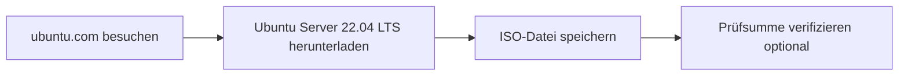
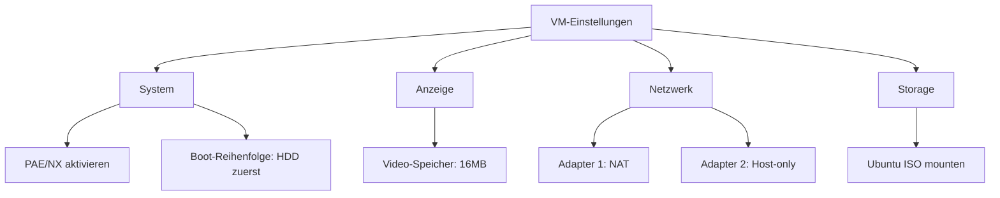

# Linux 101: Setup-Anleitung

Eine umfassende Anleitung zur Einrichtung Ihrer Linux 101 Virtual Machine-Umgebung für den Kurs.

## Inhaltsverzeichnis
1. [Systemanforderungen](#systemanforderungen)
2. [Schritt-für-Schritt VM-Setup](#schritt-für-schritt-vm-setup)
   - [Ubuntu Server herunterladen](#1-ubuntu-server-herunterladen)
   - [VirtualBox Installation](#2-virtualbox-installation)
   - [Virtuelle Maschine erstellen](#3-virtuelle-maschine-erstellen)
   - [VM-Konfiguration](#4-vm-konfiguration)
   - [Ubuntu Installation](#5-ubuntu-installation)
   - [Post-Installation Setup](#6-post-installation-setup)
   - [Snapshot Ihrer frischen Installation](#7-snapshot-ihrer-frischen-installation)
3. [Alternative: WSL2 Setup (nur Windows)](#alternative-wsl2-setup-nur-windows)
4. [Fehlerbehebung](#fehlerbehebung)
5. [Verifizierungs-Checkliste](#verifizierungs-checkliste)
6. [Tag 1 Vorbereitung](#tag-1-vorbereitung)
7. [Zusätzliche Ressourcen](#zusätzliche-ressourcen)

## Systemanforderungen

### Minimale Hardware
- **CPU**: 2 Kerne (4 empfohlen)
- **RAM**: 4GB (8GB empfohlen)
- **Speicher**: 25GB freier Speicherplatz
- **Internet**: Erforderlich für Paket-Downloads

### Software-Anforderungen
- Virtualisierungssoftware (eine davon):
  - VirtualBox (kostenlos, empfohlen)
  - VMware Workstation/Fusion
  - UTM (für Apple Silicon Macs)
  - WSL2 (Windows-Alternative)

## Schritt-für-Schritt VM-Setup

### 1. Ubuntu Server herunterladen



Download von: https://ubuntu.com/download/server
- Wählen: Ubuntu Server 22.04.3 LTS
- Datei: `ubuntu-22.04.3-live-server-amd64.iso`

### 2. VirtualBox Installation

#### Windows/Mac Intel
1. Download von: https://www.virtualbox.org/
2. Installer ausführen
3. Standardeinstellungen befolgen
4. Extension Pack installieren (empfohlen)

#### Mac Apple Silicon (M1/M2/M3)
UTM stattdessen verwenden:
1. Download von: https://mac.getutm.app/
2. Von DMG installieren
3. Mit UTM-spezifischen Schritten unten fortfahren

### 3. Virtuelle Maschine erstellen

#### VirtualBox-Einstellungen
```
Name: Linux101-Ubuntu
Typ: Linux
Version: Ubuntu (64-bit)
Speicher: 4096 MB
Storage: 25 GB (dynamisch)
```

#### Detaillierte Schritte:
1. "Neu" klicken
2. Name und OS-Typ festlegen
3. RAM zuweisen (4GB minimum)
4. Virtuelle Festplatte erstellen
5. VDI-Format wählen
6. "Dynamisch zugewiesen" auswählen
7. Größe auf 25GB setzen

### 4. VM-Konfiguration

Vor dem ersten Boot konfigurieren:



#### Wichtige Einstellungen:
- **System**: 
  - Prozessor: 2 CPUs
  - PAE/NX aktivieren
- **Anzeige**: 
  - Video-Speicher: 16MB
- **Netzwerk**: 
  - Adapter 1: NAT (Internetzugang)
  - Adapter 2: Host-only (SSH vom Host)
- **Storage**: 
  - Ubuntu ISO an optisches Laufwerk anhängen

### 5. Ubuntu Installation

#### Boot und Installation:
1. VM starten
2. "Install Ubuntu Server" auswählen
3. Sprache wählen: Deutsch (oder Englisch)
4. Installer aktualisieren wenn aufgefordert
5. Tastaturlayout: Ihre Präferenz
6. Netzwerk: DHCP verwenden

#### Installationsoptionen:
```yaml
Installationstyp: Ubuntu Server (minimiert)
Storage: Gesamte Festplatte verwenden
Hostname: linux101
Benutzername: student
Passwort: [starkes Passwort wählen]
OpenSSH Server installieren: JA
Featured Snaps: KEINE
```

### 6. Post-Installation Setup

#### Erste Anmeldung:
```bash
# Mit Ihrem Benutzernamen/Passwort anmelden
# System aktualisieren
sudo apt update
sudo apt upgrade -y

# Wesentliche Pakete installieren
sudo apt install -y \
    curl \
    wget \
    git \
    vim \
    htop \
    tree \
    net-tools \
    software-properties-common

# Installation verifizieren
lsb_release -a
```

#### SSH konfigurieren (optional aber empfohlen):
```bash
# IP-Adresse ermitteln
ip addr show

# Vom Host-Rechner
ssh student@[VM-IP-ADRESSE]
```

### 7. Snapshot Ihrer frischen Installation

**WICHTIG**: Nehmen Sie jetzt einen Snapshot!


In VirtualBox:
1. VM auswählen
2. "Snapshots" klicken
3. Snapshot nehmen
4. Name: "Frische-Installation-Basis"

## Alternative: WSL2 Setup (nur Windows)

### WSL2 aktivieren:
```powershell
# Als Administrator ausführen
wsl --install
# Computer neu starten
wsl --install -d Ubuntu-22.04
```

### Vor- und Nachteile:
✅ Bessere Leistung
✅ Integriert mit Windows
❌ Keine echte VM-Isolation
❌ Einige Einschränkungen

## Fehlerbehebung

### Häufige Probleme:

#### 1. Virtualisierung nicht aktiviert
**Symptom**: VM startet nicht
**Lösung**: VT-x/AMD-V im BIOS aktivieren

#### 2. Schwarzer Bildschirm beim Boot
**Symptom**: VM bootet zu schwarzem Bildschirm
**Lösung**: 
- 3D-Beschleunigung aktivieren
- Video-Speicher erhöhen
- Anderen Grafik-Controller versuchen

#### 3. Netzwerk funktioniert nicht
**Symptom**: Kein Internet in VM
**Lösung**:
```bash
# Netzwerk neu starten
sudo systemctl restart systemd-networkd
# Konfiguration prüfen
ip addr show
```

#### 4. SSH-Verbindung verweigert
**Symptom**: Kann nicht per SSH zur VM verbinden
**Lösung**:
```bash
# In VM, SSH-Service prüfen
sudo systemctl status ssh
sudo systemctl start ssh
# Firewall prüfen
sudo ufw status
```

## Verifizierungs-Checkliste

Führen Sie diese Befehle aus, um das Setup zu verifizieren:

```bash
# Ubuntu-Version prüfen
lsb_release -a

# Netzwerk prüfen
ping -c 4 google.com

# Speicherplatz prüfen
df -h

# Speicher prüfen
free -h

# SSH prüfen
systemctl status ssh

# Installierte Pakete auflisten
dpkg -l | grep -E "curl|wget|git|vim"
```

Erwartete Ausgabe-Beispiele:
```
student@linux101:~$ lsb_release -a
No LSB modules are available.
Distributor ID: Ubuntu
Description:    Ubuntu 22.04.3 LTS
Release:        22.04
Codename:       jammy

student@linux101:~$ df -h
Filesystem      Size  Used Avail Use% Mounted on
/dev/sda2        25G  4.2G   20G  18% /
```

## Tag 1 Vorbereitung

### Studenten-Checkliste:
- [ ] VM erstellt und Ubuntu installiert
- [ ] Kann sich mit Benutzername/Passwort anmelden
- [ ] Internet funktioniert (`ping google.com`)
- [ ] System aktualisiert (`sudo apt update`)
- [ ] Snapshot genommen
- [ ] Weiß, wie VM gestartet/gestoppt wird
- [ ] Befehl für Präsentation gewählt

### Dozenten-Verifizierung:
1. Jeden Studenten zeigen lassen:
   - VM bootet erfolgreich
   - Kann sich anmelden
   - `uname -a` ausführen
   - `ip addr show` ausführen

2. Häufige Fixes bereit haben:
   - Netzwerk-Reset-Befehle
   - Paket-Installations-Befehle
   - Snapshot-Wiederherstellungsverfahren

## Zusätzliche Ressourcen

### Video-Tutorials:
- [VirtualBox Ubuntu Setup](https://www.youtube.com/results?search_query=virtualbox+ubuntu+server+setup+deutsch)
- [WSL2 Installation](https://docs.microsoft.com/de-de/windows/wsl/install)

### Dokumentation:
- [Ubuntu Server Guide](https://ubuntu.com/server/docs)
- [VirtualBox Manual](https://www.virtualbox.org/manual/)

### Notfall-Kontakte:
- Kurs-Forum: [TBD]
- Dozenten-E-Mail: [Ihre E-Mail]
- Sprechzeiten: [Ihr Zeitplan]

---

**Denken Sie daran**: Setup-Probleme sind normal! Wir werden einen Teil von Tag 1 verwenden, um sicherzustellen, dass alle ordnungsgemäß konfiguriert sind.