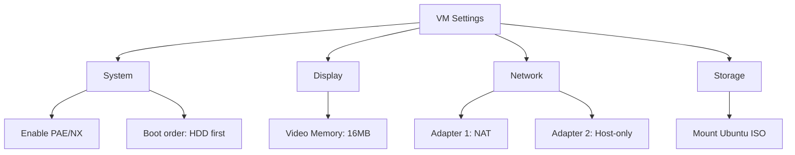

# Linux 101: Setup Guide

A comprehensive guide to set up your Linux 101 virtual machine environment for the course.

## Table of Contents
1. [System Requirements](#system-requirements)
2. [Step-by-Step VM Setup](#step-by-step-vm-setup)
   - [Download Ubuntu Server](#1-download-ubuntu-server)
   - [VirtualBox Installation](#2-virtualbox-installation)
   - [Create Virtual Machine](#3-create-virtual-machine)
   - [VM Configuration](#4-vm-configuration)
   - [Ubuntu Installation](#5-ubuntu-installation)
   - [Post-Installation Setup](#6-post-installation-setup)
   - [Snapshot Your Fresh Install](#7-snapshot-your-fresh-install)
3. [Alternative: WSL2 Setup (Windows Only)](#alternative-wsl2-setup-windows-only)
4. [Troubleshooting](#troubleshooting)
5. [Verification Checklist](#verification-checklist)
6. [Day 1 Preparation](#day-1-preparation)
7. [Additional Resources](#additional-resources)

## System Requirements

### Minimum Hardware
- **CPU**: 2 cores (4 recommended)
- **RAM**: 4GB (8GB recommended)
- **Storage**: 25GB free space
- **Internet**: Required for package downloads

### Software Requirements
- Virtualization software (one of):
  - VirtualBox (free, recommended)
  - VMware Workstation/Fusion
  - UTM (for Apple Silicon Macs)
  - WSL2 (Windows alternative)

## Step-by-Step VM Setup

### 1. Download Ubuntu Server


Download from: https://ubuntu.com/download/server
- Choose: Ubuntu Server 22.04.3 LTS
- File: `ubuntu-22.04.3-live-server-amd64.iso`

### 2. VirtualBox Installation

#### Windows/Mac Intel
1. Download from: https://www.virtualbox.org/
2. Run installer
3. Follow default settings
4. Install Extension Pack (recommended)

#### Mac Apple Silicon (M1/M2/M3)
Use UTM instead:
1. Download from: https://mac.getutm.app/
2. Install from DMG
3. Continue with UTM-specific steps below

### 3. Create Virtual Machine

#### VirtualBox Settings
```
Name: Linux101-Ubuntu
Type: Linux
Version: Ubuntu (64-bit)
Memory: 4096 MB
Storage: 25 GB (dynamic)
```

#### Detailed Steps:
1. Click "New"
2. Set name and OS type
3. Allocate RAM (4GB minimum)
4. Create virtual hard disk
5. Choose VDI format
6. Select "Dynamically allocated"
7. Set size to 25GB

### 4. VM Configuration

Before first boot, configure:



#### Key Settings:
- **System**: 
  - Processor: 2 CPUs
  - Enable PAE/NX
- **Display**: 
  - Video Memory: 16MB
- **Network**: 
  - Adapter 1: NAT (internet access)
  - Adapter 2: Host-only (SSH from host)
- **Storage**: 
  - Attach Ubuntu ISO to optical drive

### 5. Ubuntu Installation

#### Boot and Install:
1. Start VM
2. Select "Install Ubuntu Server"
3. Choose language: English
4. Update installer if prompted
5. Keyboard layout: Your preference
6. Network: Use DHCP

#### Installation Options:
```yaml
Installation type: Ubuntu Server (minimized)
Storage: Use entire disk
Hostname: linux101
Username: student
Password: [choose strong password]
Install OpenSSH server: YES
Featured snaps: NONE
```

### 6. Post-Installation Setup

#### First Login:
```bash
# Login with your username/password
# Update system
sudo apt update
sudo apt upgrade -y

# Install essential packages
sudo apt install -y \
    curl \
    wget \
    git \
    vim \
    htop \
    tree \
    net-tools \
    software-properties-common

# Verify installation
lsb_release -a
```

#### Configure SSH (Optional but Recommended):
```bash
# Get IP address
ip addr show

# From host machine
ssh student@[VM-IP-ADDRESS]
```

### 7. Snapshot Your Fresh Install

**IMPORTANT**: Take a snapshot now!


In VirtualBox:
1. Select VM
2. Click "Snapshots"
3. Take Snapshot
4. Name: "Fresh-Install-Base"

## Alternative: WSL2 Setup (Windows Only)

### Enable WSL2:
```powershell
# Run as Administrator
wsl --install
# Restart computer
wsl --install -d Ubuntu-22.04
```

### Pros and Cons:
✅ Better performance
✅ Integrated with Windows
❌ Not true VM isolation
❌ Some limitations

## Troubleshooting

### Common Issues:

#### 1. Virtualization Not Enabled
**Symptom**: VM won't start
**Fix**: Enable VT-x/AMD-V in BIOS

#### 2. Black Screen on Boot
**Symptom**: VM boots to black screen
**Fix**: 
- Enable 3D acceleration
- Increase video memory
- Try different graphics controller

#### 3. Network Not Working
**Symptom**: No internet in VM
**Fix**:
```bash
# Restart networking
sudo systemctl restart systemd-networkd
# Check configuration
ip addr show
```

#### 4. SSH Connection Refused
**Symptom**: Can't SSH to VM
**Fix**:
```bash
# In VM, check SSH service
sudo systemctl status ssh
sudo systemctl start ssh
# Check firewall
sudo ufw status
```

## Verification Checklist

Run these commands to verify setup:

```bash
# Check Ubuntu version
lsb_release -a

# Check network
ping -c 4 google.com

# Check disk space
df -h

# Check memory
free -h

# Check SSH
systemctl status ssh

# List installed packages
dpkg -l | grep -E "curl|wget|git|vim"
```

Expected output examples:
```
student@linux101:~$ lsb_release -a
No LSB modules are available.
Distributor ID: Ubuntu
Description:    Ubuntu 22.04.3 LTS
Release:        22.04
Codename:       jammy

student@linux101:~$ df -h
Filesystem      Size  Used Avail Use% Mounted on
/dev/sda2        25G  4.2G   20G  18% /
```

## Day 1 Preparation

### Student Checklist:
- [ ] VM created and Ubuntu installed
- [ ] Can login with username/password
- [ ] Internet working (`ping google.com`)
- [ ] System updated (`sudo apt update`)
- [ ] Snapshot taken
- [ ] Know how to start/stop VM
- [ ] Chosen command for presentation

### Instructor Verification:
1. Have each student show:
   - VM boots successfully
   - Can login
   - Run `uname -a`
   - Run `ip addr show`

2. Common fixes ready:
   - Network reset commands
   - Package installation commands
   - Snapshot restore procedure

## Additional Resources

### Video Tutorials:
- [VirtualBox Ubuntu Setup](https://www.youtube.com/results?search_query=virtualbox+ubuntu+server+setup)
- [WSL2 Installation](https://docs.microsoft.com/en-us/windows/wsl/install)

### Documentation:
- [Ubuntu Server Guide](https://ubuntu.com/server/docs)
- [VirtualBox Manual](https://www.virtualbox.org/manual/)

### Emergency Contacts:
- Course Forum: Slack

---

**Remember**: It's normal to have setup issues! We'll use part of Day 1 to ensure everyone is properly configured.