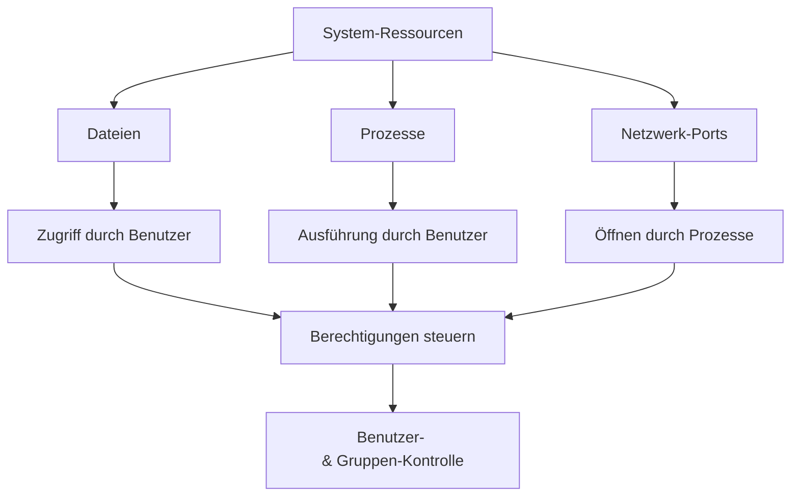
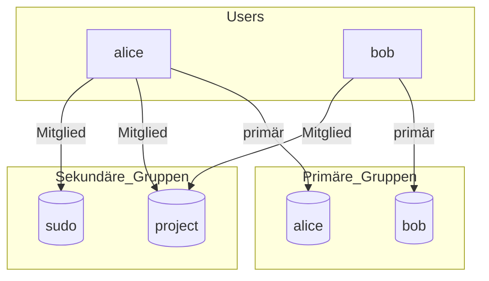
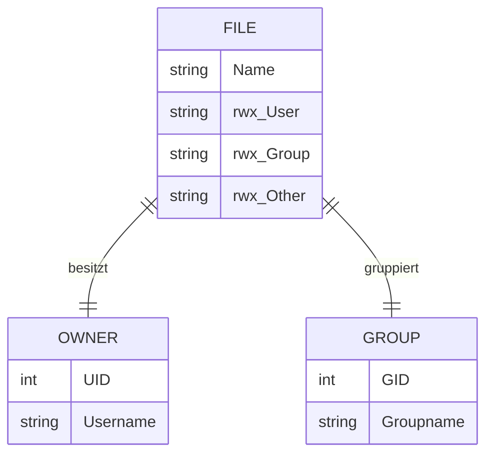
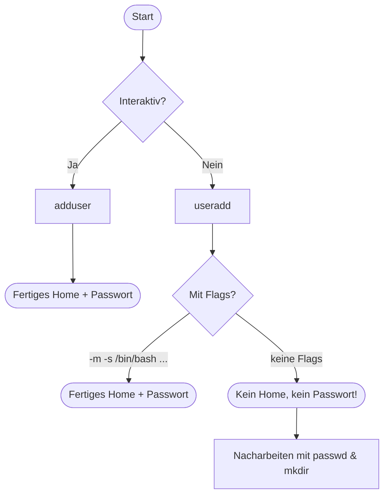

# Woche 1, Tag 3: Benutzer‑ und Gruppenverwaltung in Linux

## Lernziele

* Verstehen, warum Benutzer‑ und Gruppenverwaltung essenziell für System‑Sicherheit ist
* Die Kernbefehle zur Anlage, Änderung und Entfernung von Benutzern & Gruppen anwenden
* Dateiberechtigungen (UID/GID, rwx) korrekt interpretieren
* Praktische Szenarien zur Rechtevergabe lösen

---

## Warum Benutzer & Gruppen? (30 Minuten)

### Die Sicherheits‑Perspektive



**Schlüsselgedanken**

1. **Least‑Privilege‑Prinzip**: Jeder Dienst läuft mit minimalen Rechten.
2. **Auditierbarkeit**: Aktionen sind einem UID/GID zuordenbar.
3. **Rollenmodell**: Gruppen bündeln identische Berechtigungen.

---

## Benutzerverwaltung (45 Minuten)

### Kernbefehle & Konzepte

| Aktion                         | Befehl                  | Erläuterung                                 |
| ------------------------------ | ----------------------- | ------------------------------------------- |
| Interaktiven Benutzer anlegen  | `sudo adduser alice`    | Erstellt Home, fragt Passwort – *empfohlen* |
| Low‑Level Benutzer anlegen     | `sudo useradd alice`    | Keine Interaktion, zusätzliche Flags nötig  |
| Passwort setzen                | `sudo passwd alice`     | Ändert/erstellt Passwort                    |
| Benutzerinformationen anzeigen | `id alice`              | Zeigt UID, GID, Gruppen                     |
| Temporär zum Benutzer wechseln | `su - alice`            | Neue Login‑Shell                            |
| Befehl als Benutzer ausführen  | `sudo -u alice <cmd>`   | *Privileges on demand*                      |
| Benutzer sperren               | `sudo usermod -L alice` | Passwort‑Hash wird deaktiviert              |
| Benutzer löschen (inkl. Home)  | `sudo userdel ‑r alice` | Entfernt Account & Home                     |

> **Hinweis:** Alle Account‑Einträge liegen in `/etc/passwd`, Passwort‑Hashes in `/etc/shadow`.

### Benutzer‑Attribute

```text
UID    : 0 = root, 1‑99 = System, 100‑59999 = regulär
GID    : Primäre Gruppe des Accounts
/home  : Standardspeicherort für persönliche Daten
shell : Login‑Shell, üblicherweise /bin/bash
```

---

## Gruppenverwaltung (30 Minuten)

### Gruppenbefehle

| Aktion                        | Befehl                        |
| ----------------------------- | ----------------------------- |
| Neue Gruppe anlegen           | `sudo groupadd devs`          |
| Benutzer zu Gruppe hinzufügen | `sudo usermod ‑aG devs alice` |
| Benutzer aus Gruppe entfernen | `sudo gpasswd ‑d alice devs`  |
| Gruppe löschen                | `sudo groupdel devs`          |

### Primäre vs. Sekundäre Gruppen

```mermaid
graph LR
subgraph "Account"
U[alice (UID 1001)]
end
subgraph "Gruppen"
G1[(alice)]
G2[(devs)]
G3[(sudo)]
end
U -- primär --> G1
U -- sekundär --> G2
U -- sekundär --> G3
```

*Primäre Gruppe* bestimmt Besitz neuer Dateien; *sekundäre Gruppen* gewähren zusätzliche Rechte.

---

## Dateibesitz & Berechtigungen (30 Minuten)

### Klassisches `rwx`‑Modell

```text
           User  Group  Other
Symbolisch  rwx   r‑x    r‑‑
Oktal       7     5      4
```

* **r** = read (4)  **w** = write (2)  **x** = execute (1)
* Besitz ändern: `sudo chown alice:devs project.txt`
* Rechte setzen: `chmod 754 project.txt`
* Setuid/Setgid/Sticky verstehen (`chmod 4755 file`)

---

## Praktisches Labor: Benutzer‑ & Gruppenverwaltung (60 Minuten)

### Labor‑Ziele

1. Zwei neue Accounts anlegen und konfigurieren
2. Gemeinsames Projekt‑Verzeichnis mit Gruppenrechten erstellen
3. **sudo**‑Rechte sicher vergeben
4. Datei‑Besitz & Berechtigungen verifizieren

### Labor‑Aufgaben

#### Aufgabe 1 – Accounts anlegen

```bash
sudo adduser alice   # Passwort setzen
sudo adduser bob
```

#### Aufgabe 2 – Gemeinsame Gruppe & Verzeichnis

```bash
# Gruppe erstellen
auth="project"
sudo groupadd $auth
# Benutzer hinzufügen
for u in alice bob; do sudo usermod -aG $auth $u; done
# Verzeichnis + Rechte
sudo mkdir /srv/shared
sudo chown root:$auth /srv/shared
sudo chmod 2775 /srv/shared   # setgid-Bit
```

#### Aufgabe 3 – Sudo für Alice

```bash
sudo usermod -aG sudo alice
```

#### Aufgabe 4 – Tests & Validierung

```bash
# Als Alice wechseln
su - alice -c "touch /srv/shared/test.txt && ls -l /srv/shared/test.txt"
# Prüfen, dass Gruppe = project
ls -ld /srv/shared
# Als Bob Datei lesen
su - bob -c "cat /srv/shared/test.txt"
```

### Labor‑Fragen

1. Welche UID hat **bob**?
2. Welche Gruppenmitgliedschaften hat **alice**?
3. Warum wird bei `/srv/shared` die **GID** automatisch auf **project** gesetzt?
4. Welche Rechte müssen mindestens gesetzt sein, damit Bob *Datei A* lesen kann?

---

## Wichtige Erkenntnisse

1. **Root ist mächtig** – arbeite mit sudo, nicht dauerhaft als root
2. **Least Privilege** – gib nur benötigte Gruppenrechte
3. **Setgid‑Verzeichnisse** erben die Gruppen‑ID neuer Dateien
4. **`/etc/passwd`**\*\* ≠ Passwörter\*\* – Passwort‑Hashes liegen in `/etc/shadow`
5. **Ab‑ & Anmelden nötig** nach Gruppenänderungen

## Häufige Anfängerfehler

* Mit `useradd` statt `adduser` starten und dann kein Home/Passwort haben
* `chmod 777` für „schnelle“ Lösungen verwenden
* Gruppenänderungen testen, ohne sich neu anzumelden
* Passwörter im Klartext via `echo "pass" | passwd` setzen

---

## Zusätzliche Ressourcen

* [GNU coreutils useradd(8) Handbuch](https://man7.org/linux/man-pages/man8/useradd.8.html)
* [Linux Journey – Users & Groups](https://linuxjourney.com/lesson/users-and-groups)
* [ExplainShell – Interaktive Befehlsanalyse](https://explainshell.com/)

## Mermaid‑Visuals: Beziehungen auf einen Blick

### 1. Primäre vs. Sekundäre Gruppen



### 2. Setgid‑Verzeichnis und geerbte Gruppen‑ID

```mermaid
flowchart LR
    srv[/srv/shared\n(setgid)] -- "touch test.txt" --> file[test.txt]
    srv -- GID: project --> gid_proj[(project)]
    file -- erbt --> gid_proj
```

### 3. Dateiberechtigungen Matrix



---

## Quick‑Reference Cheat Sheet (1‑Pager)

| Zweck                         | Befehl / Datei                                  | Notiz                         |
| ----------------------------- | ----------------------------------------------- | ----------------------------- |
| Alle Benutzer anzeigen        | `cut -d: -f1 /etc/passwd`                       | Nur Namen                     |
| Details eines Benutzers       | `id alice`                                      | UID/GID & Gruppen             |
| Alle Gruppen anzeigen         | `cut -d: -f1 /etc/group`                        | Nur Gruppennamen              |
| Gruppen eines Users           | `groups alice`                                  | Sekundär + primär             |
| Temporär neue Gruppensitzung  | `newgrp project`                                | Ohne Abmelden                 |
| Liste sudo‑Berechtigungen     | `sudo -l -U alice`                              | Welche Befehle erlaubt?       |
| Benutzer mit useradd komplett | `sudo useradd -m -s /bin/bash -U -G sudo alice` | Low‑Level, aber *vollständig* |
| Standard‑Dateirechte prüfen   | `umask`                                         | 0022 = 755/644                |
| ACL statt rwx verwenden       | `setfacl -m u:bob:rwx file`                     | Erweiterte Rechte             |

> 💡 **Merksatz**: „*adduser fragt, useradd sagt nichts.*“ – wenn der Befehl schweigt, musst **du** denken.

### Flow: adduser vs useradd



---

## Häufig gestellte Fragen (FAQ)

1. **Wie ändere ich den Benutzernamen?**
   `sudo usermod -l neuername -d /home/neuername -m altername`
2. **Wie setze ich ein Ablaufdatum für Accounts?**
   `sudo chage -E 2025-12-31 alice`
3. **Was ist eine *****User Private Group***** (UPG)?**
   Moderne Distros legen für jeden Benutzer automatisch eine gleichnamige Gruppe an. Vorteil: sichere `umask 0002` – Dateien gehören der persönlichen Gruppe, nicht `users`.
4. **Welche Shell steht dem Benutzer zur Verfügung?**
   In `/etc/passwd` – Feld 7. Ändern mit `sudo chsh -s /usr/bin/zsh alice`.
5. **Wie übertrage ich das komplette Home auf einen anderen Server?**
   `sudo rsync -aAX /home/alice root@server:/home/`

---

## Troubleshooting: Typische Fehlermeldungen & Lösungen

| Meldung                                      | Ursache                                | Fix                                                            |
| -------------------------------------------- | -------------------------------------- | -------------------------------------------------------------- |
| `Permission denied` beim `su alice`          | Passwort gesperrt (`!` im /etc/shadow) | `sudo passwd -u alice`                                         |
| `No directory, logging in with HOME=/`       | Home‑Verzeichnis fehlt                 | `sudo mkdir /home/alice && sudo chown alice:alice /home/alice` |
| `id: ‚alice‘: no such user`                  | Schreibfehler oder User gelöscht       | `grep alice /etc/passwd` checken                               |
| `groups: cannot find name for group ID 1005` | /etc/group‑Eintrag fehlt               | `sudo groupadd -g 1005 missing && sudo usermod -g 1005 alice`  |

---

## Mini‑Quiz (5 Fragen zur Selbstprüfung)

1. **Welche Datei enthält Passwort‑Hashes?**  (a) `/etc/shadow`  (b) `/etc/passwd`  (c) `/etc/group`
2. Welches Flag sorgt dafür, dass `useradd` ein Home‑Verzeichnis erstellt?
   a) `-U`  b) `-s`  c) `-m`  d) `-G`
3. Ein Verzeichnis hat die Rechte `2775`. Welche Bedeutung hat die führende `2`?
4. Wie kannst du ohne Abmelden sofort in eine neue Gruppe `docker` wechseln?
5. `chmod 640 file` – wer kann **nicht** schreiben?

> **Antworten:** 1‑a  2‑c  3 = setgid‑Bit  4 `newgrp docker`  5 „Other“ & „Group“ (nur Owner hat w‑Bit)

---

## Weitere Vertiefung

* **Skeleton‑Verzeichnis (****`/etc/skel`****)**: Nutze es, um Standard‑Dateien (z. B. `.bashrc`) für neue Benutzer vorzubereiten.

  ```bash
  echo '# Willkommen!' | sudo tee /etc/skel/README.txt
  ```

---
