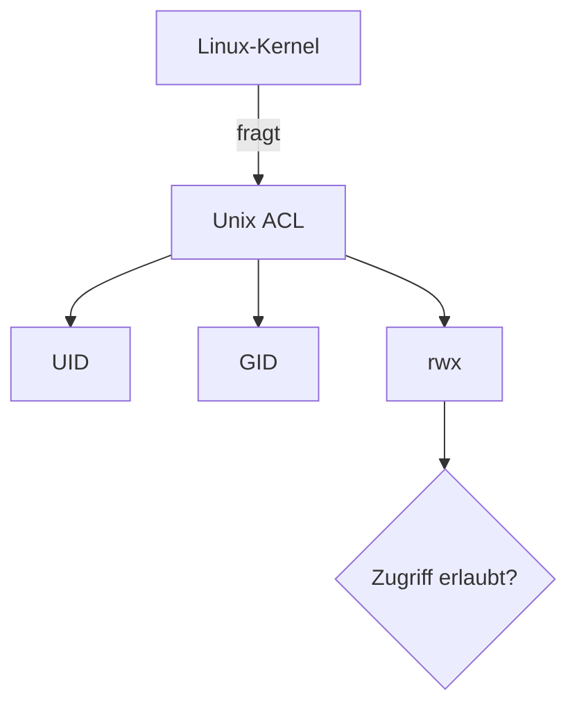
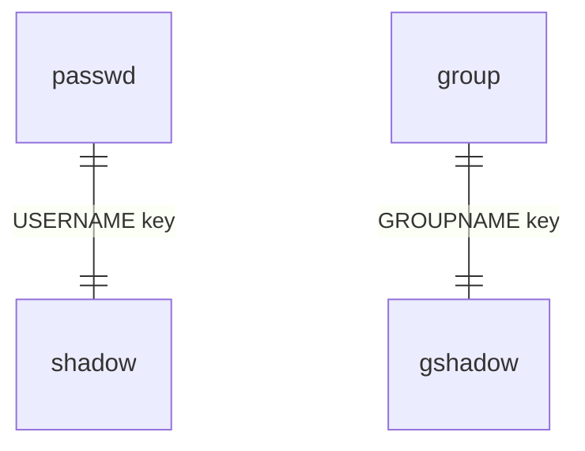

Woche 1, Tag 3 — Benutzer‑ & Gruppen‑Grundlagen (Linux Essentials 1.6)
Ziel: Verstehe die Konzepte hinter Benutzerkonten, UIDs/GIDs & Zugriffskontroll‑Dateien, bevor wir mit praktischer Verwaltung fortfahren.

## 0 · Lernziele

* **Benutzer‑ & Kontotypen** (root, regulär, System‑ & Service‑Accounts) unterscheiden
* **UID/GID‑Räume** & ihr Zweck erklären
* **Wichtige Zugriffskontrolldateien** in `/etc` aufzählen & beschreiben
* **CLI‑Tools** einsetzen, um Informationen über Benutzer & Anmeldungen abzurufen

---

## 1 · Einführung in Zugriffskontrollen (5 min)

Linux erbt die Unix-Access-Control von 1970 — immer noch schlank & effektiv. Moderne Desktop-Umgebungen setzen vieles automatisch, doch das Fundament bleibt unverändert:



---

## 2 · Kontotypen & UID‑Bereiche (20 min)

| Kontotyp         | UID‑Range (üblich) | Home    | Shell              | Beispiel          |
| ---------------- | ------------------ | ------- | ------------------ | ----------------- |
| **root**         | 0                  | `/root` | `/bin/bash`        | root              |
| **System (alt)** | 1–99 (oder <100)   | —       | `/sbin/nologin`    | daemon, bin       |
| **System (neu)** | 100–499            | —       | `/sbin/nologin`    | systemd‑network   |
| **Service**      | 500–999 oder >1000 | var.    | `/sbin/nologin`    | postgres (Fedora) |
| **Benutzer**     | ≥ 1000             | `/home` | `/bin/bash` (std.) | emma              |

> **Merksatz:** UID 0 sieht alles, UID < 100 redet wenig, UID ≥ 1000 arbeitet kreativ.

**Primäre & sekundäre Gruppen**

* Primäre GID bestimmt Datei‑Besitz bei Anlage
* Sekundäre Gruppen bündeln zusätzliche Rechte

---

## 3 · Schlüssel‑Dateien in `/etc` (15 min)

| Datei          | Inhalt (gekürzt)                      | Wer darf lesen? |
| -------------- | ------------------------------------- | --------------- |
| `/etc/passwd`  | UID, GID, Home, Shell, kein Hash      | alle            |
| `/etc/shadow`  | Passwort‑Hashes, Ablaufdaten          | root, authd     |
| `/etc/group`   | Gruppenname ↔ GID, Mitglieder         | alle            |
| `/etc/gshadow` | Gruppen‑Hashes, Admin‑Listen          | root            |
| `/etc/sudoers` | sudo‑Regeln (via `visudo` bearbeiten) | root            |



---

## 4 · CLI‑Infos abrufen (10 min)

| Zweck            | Befehl           | Sample‑Output (gekürzt)     |
| ---------------- | ---------------- | --------------------------- |
| Eigene IDs sehen | `id`             | `uid=1000(emma) gid=1000 …` |
| Andere anzeigen  | `id bob`         | —                           |
| Aktive Logins    | `who` / `w`      | TTY, Idle, Cmd              |
| Login‑Historie   | `last` / `lastb` | erfolgreich / fehlgeschl.   |

Tipp: Nutze `last -F | head` für die letzten 10 Events mit Zeitstempel.

---

## 5 · Mini‑Übung (20 min)

> *Keine Änderungen am System! Nur lesen & beobachten.*

1. Zeige alle Konten mit UID < 100 an:

   ```bash
   awk -F: '$3<100 {print $1,$3}' /etc/passwd
   ```

2. Notiere die GIDs der Gruppen, in denen du Mitglied bist:

   ```bash
   id -Gn
   id -G
   ```

---

## 6 · Reflexions‑Fragen (5 min)

* Warum ist `/etc/passwd` für alle lesbar, `/etc/shadow` aber nicht?
* Welche Risiken birgt ein Service‑Account mit gültiger Bash‑Shell?
* Wann würdest du einem Dienst kein eigenes Konto geben?

---

# Übungsaufgaben: User-Management

## 1. User anlegen & prüfen

**Aufgabe:** Lege den Nutzer **bernd** an, inklusive Home-Verzeichnis und Bash-Shell.
**Prüfen:** Ermittele anschließend mit den passenden Befehlen, welche UID, GID und Gruppen **bernd** zugewiesen sind.

## 2. Passwort setzen & testen

**Aufgabe:** Vergib für **bernd** ein Passwort und wechsle in seinen Benutzerkontext.
**Test:** Erstelle in seinem Home-Verzeichnis eine Datei `~/.login_test` und wechsle zurück zum Admin.

## 3. Datei-Eigentümer prüfen

**Aufgabe:** Lege als Admin eine Bashdatei mit echo "hello world" unter `/home` an und weise sie **bernd** als Eigentümer zu. Setze gezielt (chmod) die Gruppen- und Benutzerrechte so das Bernd die Datei nicht ausführen kann.
**Test:** Melde dich als **bernd** an und prüfe Lese- und Schreib und Ausführrechte der Datei.

## 4. Gruppe anlegen & User hinzufügen

**Aufgabe:** Erstelle die Gruppe **projekt** und füge **bernd** als Sekundärmitglied hinzu.
**Prüfen:** Überprüfe anschließend, dass **bernd** wirklich Teil der Gruppe **projekt** ist.

## 5. Aufräumen: User & Gruppe löschen

**Aufgabe:** Entferne **bernd** aus der Gruppe **projekt**, lösche den Benutzer **bernd** mitsamt seinem Home-Verzeichnis und entferne abschließend die Gruppe **projekt**.


# Übungsaufgaben: Gruppen-Management

## 1. Gruppe anlegen & Eigenschaften prüfen

**Aufgabe:** Erstelle die Gruppe **marketing**.
**Prüfen:** Welche GID und Einträge existieren für **marketing**? Nutze die passenden Befehle, um das zu ermitteln.

## 2. Benutzer zur Gruppe hinzufügen & entfernen

**Aufgabe:** Füge den bestehenden Benutzer **bernd** zur Gruppe **marketing** hinzu und entferne ihn anschließend wieder.
**Prüfen:** Wie überprüfst du, dass **bernd** zur Gruppe gehört bzw. nicht mehr dazugehört?

## 3. Primäre Gruppe ändern

**Aufgabe:** Lege die Gruppe **support** an und setze sie als primäre Gruppe von **bernd**.
**Prüfen:** Wie kannst du via `id` oder anderen Befehlen bestätigen, dass die GID jetzt zu **support** gehört?

## 4. Set-GID auf Verzeichnis anwenden

**Aufgabe:** Erstelle ein Verzeichnis `/srv/team_docs` und aktiviere das Set-GID-Bit (chmod g+s).
**Prüfen:** Wie kannst du zeigen, dass neu erstellte Dateien im Verzeichnis die Gruppen-ID von `/srv/team_docs` geerbt haben?

## 5. Gruppe umbennen & löschen

**Aufgabe:** Benenne die Gruppe **support** in **helpdesk** um, lege einen Dummy-Benutzer **tester** an, füge ihn zu **helpdesk** hinzu und überprüfe die Umbenennung.
**Aufräumen:** Lösche abschließend sowohl die Gruppe **helpdesk** als auch den Dummy-Benutzer.

> **Hinweis:** Nutzt für alle Befehle `sudo` und kontrolliert jeden Schritt mit `getent`, `id`, `groups` oder `ls -l`. Viel Erfolg!
