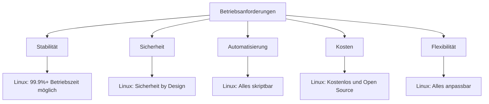
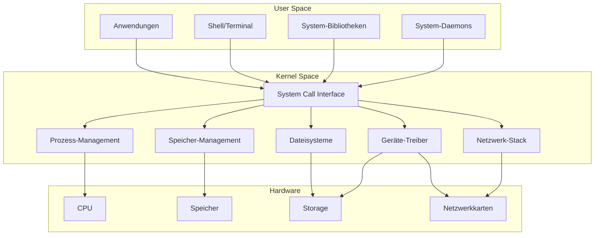
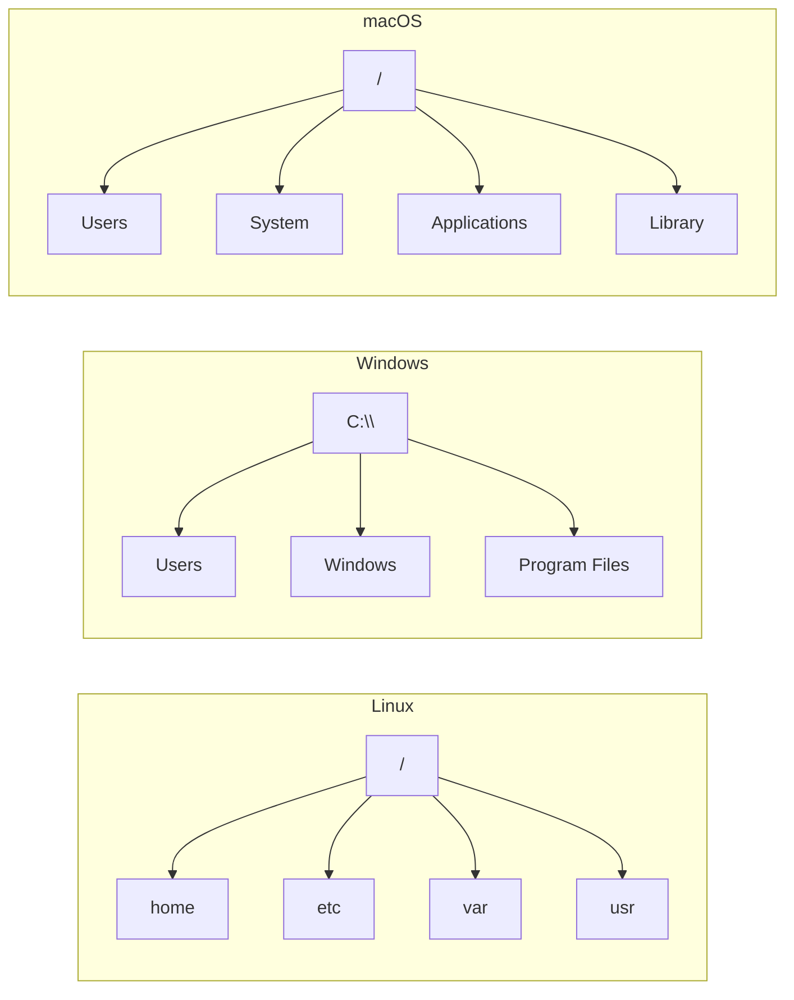
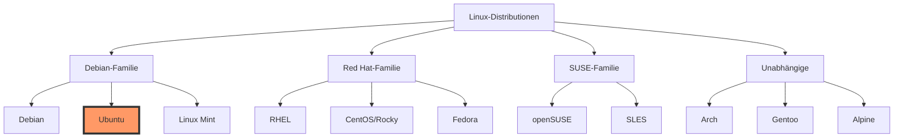

# Woche 1, Tag 2: Linux Geschichte & Architektur

## Lernziele
- Verstehen, warum Linux im Betrieb dominiert
- Schlüsselkomponenten der Linux-Architektur identifizieren
- Linux mit anderen Betriebssystemen vergleichen
- Im Linux-Ökosystem navigieren

## Warum Linux im Betrieb? (30 Minuten)

### Die Betriebsperspektive



### Reale Nutzungsstatistiken
- 96,3% der Top 1 Million Webserver laufen mit Linux
- 100% der Top 500 Supercomputer nutzen Linux
- ~70% der Smartphones (Android) basieren auf Linux
- Große Cloud-Anbieter (AWS, Google, Azure) laufen auf Linux

### Schlüsselvorteile für Ops
1. **Alles skriptbar**: Jede Aufgabe kann automatisiert werden
2. **Remote-Management**: SSH eingebaut, keine GUI nötig
3. **Ressourcenschonend**: Läuft auf minimaler Hardware
4. **Transparent**: Kann jede Komponente inspizieren/modifizieren
5. **Community**: Massive Unterstützung und Dokumentation

## Linux-Architektur (45 Minuten)

### System-Schichten



### Schlüsselkomponenten erklärt

#### 1. Kernel
- Herz von Linux
- Verwaltet Hardware-Ressourcen
- Stellt System-Calls bereit
- Übernimmt Sicherheit

#### 2. Shell
- Befehls-Interpreter
- Benutzeroberfläche zum Kernel
- Bash ist am häufigsten
- Skriptfähige Schnittstelle

#### 3. Dateisystem
- Alles ist eine Datei
- Hierarchische Struktur
- Virtuelle Dateisysteme
- Gerätedateien

#### 4. Prozesse
- Laufende Programme
- Eltern-Kind-Hierarchie
- Init-Prozess (PID 1)
- Prozess-Scheduling

## Linux vs. Andere (30 Minuten)

### Vergleichsmatrix

| Feature | Linux | Windows | macOS |
|---------|-------|---------|-------|
| **Kosten** | Kostenlos | Lizenziert | Hardware-gebunden |
| **Quellcode** | Offen | Geschlossen | Teilweise offen |
| **CLI** | Primär | Sekundär | Gute CLI |
| **Server** | Dominant | Verbreitet | Selten |
| **Anpassung** | Total | Begrenzt | Moderat |
| **Sicherheitsmodell** | Berechtigung-basiert | ACL-basiert | Unix-basiert |
| **Paket-Mgmt** | APT/YUM/etc | MSI/Store | Brew/App Store |
| **Remote-Zugriff** | SSH nativ | RDP/PSRemoting | SSH nativ |

### Dateisystem-Unterschiede



## Distributions-Landschaft (30 Minuten)

### Große Distributions-Familien



### Warum Ubuntu zum Lernen?
1. **Anfängerfreundlich**: Großartige Dokumentation
2. **LTS-Versionen**: 5 Jahre Support
3. **Riesige Community**: Einfach Hilfe zu finden
4. **Server-beliebt**: Häufig in Produktion
5. **Paket-reich**: Umfangreiche Repositories

### Ubuntu Release-Zyklus
- LTS alle 2 Jahre (22.04, 24.04)
- Reguläre Releases alle 6 Monate
- Version = Jahr.Monat (22.04 = April 2022)

## Praktisches Labor: Erste Boot-Erkundung (45 Minuten)

### Labor-Ziele
1. Ihre Ubuntu VM booten
2. Das System erkunden
3. Wichtige Unterschiede zu Windows/macOS identifizieren
4. Ihre Erkenntnisse dokumentieren

### Labor-Aufgaben

#### Aufgabe 1: System-Informationen
```bash
# Ubuntu-Version prüfen
lsb_release -a

# Kernel-Version prüfen
uname -r

# System-Architektur prüfen
uname -m

# System-Informationen anzeigen
hostnamectl
```

#### Aufgabe 2: Dateisystem erkunden
```bash
# Root-Verzeichnis anzeigen
ls /

# System-Verzeichnisse erkunden
ls /etc
ls /var
ls /home

# Speicherplatz-Nutzung prüfen
df -h

# Konfigurationsdateien finden
ls /etc | head -20
```

#### Aufgabe 3: Prozess-Erkundung
```bash
# Laufende Prozesse anzeigen
ps aux | head

# System-Ressourcen prüfen
top
# 'q' drücken zum Beenden

# Ihre Benutzer-Info anzeigen
whoami
id

# System-Betriebszeit prüfen
uptime
```

#### Aufgabe 4: Netzwerk-Grundlagen
```bash
# Netzwerk-Konfiguration anzeigen
ip addr show

# Konnektivität testen
ping -c 4 google.com

# Netzwerk-Verbindungen anzeigen
ss -tuln
```

### Labor-Fragen
1. Welche Ubuntu-Version läuft bei Ihnen?
2. Wie viel RAM hat Ihr System?
3. Wie lautet Ihre IP-Adresse?
4. Wie viele Prozesse laufen?
5. Was überrascht Sie am meisten an Linux?

## Wichtige Erkenntnisse

### Diese Punkte merken
1. **Alles ist eine Datei** in Linux
2. **Groß-/Kleinschreibung** immer beachten
3. **Keine Laufwerksbuchstaben** - einziger Dateibaum
4. **Berechtigungen sind wichtig** für Sicherheit
5. **CLI ist primär** - GUI ist optional

### Häufige Anfängerfehler
- Groß-/Kleinschreibung vergessen
- Windows-Pfade verwenden (C:\)
- Fehlermeldungen nicht lesen
- Man-Pages überspringen
- Unnötig als root arbeiten

## Hausaufgaben

### Lektüre
- Lesen: "The Cathedral and the Bazaar" (erste 3 Kapitel)
- Link: http://www.catb.org/~esr/writings/cathedral-bazaar/

### Praxis
1. Ihre VM 3 Mal booten
2. Verzeichnisse nur mit CLI navigieren
3. 5 Befehle aus Klassenkameraden-Präsentationen ausprobieren
4. 5 Fragen für nächste Stunde aufschreiben

### Reflektion
Schreiben Sie einen Absatz über:
- Was begeistert Sie an Linux?
- Was bereitet Ihnen Sorgen?
- Wie könnte Linux Ihre Karriere fördern?

## Vorschau nächste Stunde
- Wesentliche Befehle Vertiefung
- Dateimanipulation
- Effektiv Hilfe bekommen
- Kommandozeilen-Produktivitätstipps

---

## Zusätzliche Ressourcen
- [Ubuntu Offizielle Dokumentation](https://ubuntu.com/server/docs)
- [Linux Journey - Kostenloses Tutorial](https://linuxjourney.com/)
- [ExplainShell - Befehls-Erklärer](https://explainshell.com/)

## Dozenten-Notizen
- "Warum" betonen, nicht nur "wie"
- Echte Ops-Kriegsgeschichten teilen
- Experimentieren ermutigen
- Fehler machen normalisieren
- Vertrauen schrittweise aufbauen