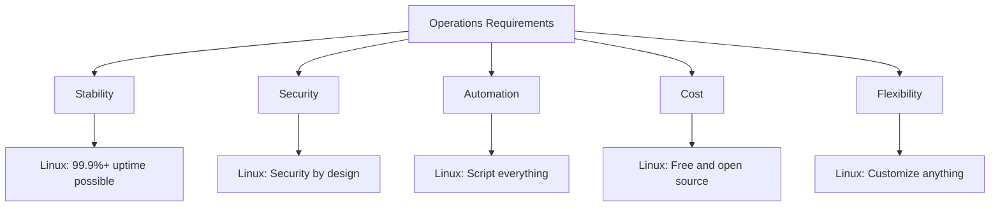
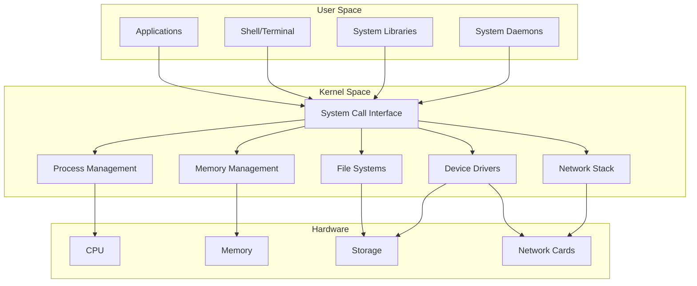
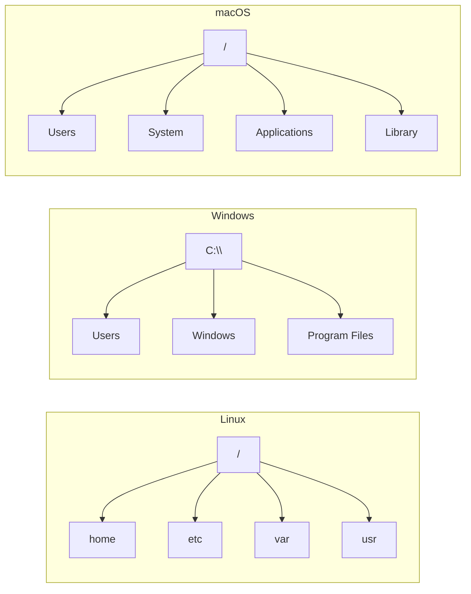
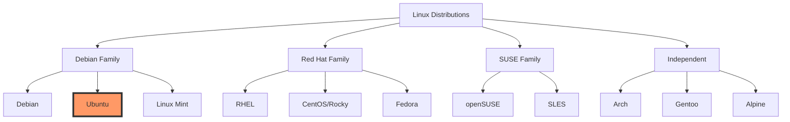

# Week 1, Day 2: Linux History & Architecture

## Learning Objectives
- Understand why Linux dominates in operations
- Identify key components of Linux architecture
- Compare Linux with other operating systems
- Navigate the Linux ecosystem

## Why Linux in Operations? (30 minutes)

### The Operations Perspective



### Real-World Usage Stats
- 96.3% of top 1 million web servers run Linux
- 100% of top 500 supercomputers use Linux
- 85% of smartphones (Android) based on Linux
- Major cloud providers (AWS, Google, Azure) run on Linux

### Key Advantages for Ops
1. **Scriptable Everything**: Any task can be automated
2. **Remote Management**: SSH built-in, no GUI needed
3. **Resource Efficient**: Runs on minimal hardware
4. **Transparent**: Can inspect/modify any component
5. **Community**: Massive support and documentation

## Linux Architecture (45 minutes)

### System Layers



### Key Components Explained

#### 1. Kernel
- Heart of Linux
- Manages hardware resources
- Provides system calls
- Handles security

#### 2. Shell
- Command interpreter
- User interface to kernel
- Bash is most common
- Scriptable interface

#### 3. File System
- Everything is a file
- Hierarchical structure
- Virtual file systems
- Device files

#### 4. Processes
- Running programs
- Parent-child hierarchy
- Init process (PID 1)
- Process scheduling

## Linux vs Others (30 minutes)

### Comparison Matrix

| Feature | Linux | Windows | macOS |
|---------|-------|---------|-------|
| **Cost** | Free | Licensed | Hardware-tied |
| **Source** | Open | Closed | Partially open |
| **CLI** | Primary | Secondary | Good CLI |
| **Servers** | Dominant | Common | Rare |
| **Customization** | Total | Limited | Moderate |
| **Security Model** | Permission-based | ACL-based | Unix-based |
| **Package Mgmt** | APT/YUM/etc | MSI/Store | Brew/App Store |
| **Remote Access** | SSH native | RDP/PSRemoting | SSH native |

### File System Differences



## Distribution Landscape (30 minutes)

### Major Distribution Families



### Why Ubuntu for Learning?
1. **Beginner Friendly**: Great documentation
2. **LTS Versions**: 5 years of support
3. **Huge Community**: Easy to find help
4. **Server Popular**: Common in production
5. **Package Rich**: Extensive repositories

### Ubuntu Release Cycle
- LTS every 2 years (22.04, 24.04)
- Regular releases every 6 months
- Version = Year.Month (22.04 = April 2022)

## Hands-On Lab: First Boot Exploration (45 minutes)

### Lab Objectives
1. Boot your Ubuntu VM
2. Explore the system
3. Identify key differences from Windows/macOS
4. Document your findings

### Lab Tasks

#### Task 1: System Information
```bash
# Check Ubuntu version
lsb_release -a

# Check kernel version
uname -r

# Check system architecture
uname -m

# Display system information
hostnamectl
```

#### Task 2: Explore File System
```bash
# View root directory
ls /

# Explore system directories
ls /etc
ls /var
ls /home

# Check disk usage
df -h

# Find configuration files
ls /etc | head -20
```

#### Task 3: Process Exploration
```bash
# View running processes
ps aux | head

# Check system resources
top
# Press 'q' to quit

# See your user info
whoami
id

# Check system uptime
uptime
```

#### Task 4: Network Basics
```bash
# View network configuration
ip addr show

# Test connectivity
ping -c 4 google.com

# View network connections
ss -tuln
```

### Lab Questions
1. What version of Ubuntu are you running?
2. How much RAM does your system have?
3. What is your IP address?
4. How many processes are running?
5. What surprises you most about Linux?

## Key Takeaways

### Remember These Points
1. **Everything is a file** in Linux
2. **Case sensitive** always
3. **No drive letters** - single file tree
4. **Permissions matter** for security
5. **CLI is primary** - GUI is optional

### Common Beginner Mistakes
- Forgetting case sensitivity
- Using Windows paths (C:\)
- Not reading error messages
- Skipping man pages
- Running as root unnecessarily

---

## Additional Resources
- [Ubuntu Official Documentation](https://ubuntu.com/server/docs)
- [Linux Journey - Free Tutorial](https://linuxjourney.com/)
- [ExplainShell - Command Explainer](https://explainshell.com/)
