# Woche 2, Tag 1 — Dateiberechtigungen Deep Dive

## 🎯 Tagesziel
**Dauer**: 3 Stunden  
**Format**: Theorie + Praktische Übungen  
**Ziel**: Vollständiges Verständnis des Linux-Berechtigungssystems

---

## 📋 Tagesablauf

### Block 1: Grundlagen wiederholen & vertiefen (45 Min.)
- Wiederholung rwx-Konzept
- Oktalnotation meistern
- Spezielle Berechtigungen verstehen

### Block 2: Praktische Anwendungen (75 Min.)
- Hands-on Übungen
- Real-World Szenarien
- Troubleshooting

### Block 3: Erweiterte Konzepte (60 Min.)
- SUID, SGID, Sticky Bit
- umask verstehen
- ACLs Einführung

---

## 🔐 Block 1: Dateiberechtigungen Grundlagen (45 Min.)

### 1.1 Das rwx-System verstanden

```mermaid
graph LR
    A[Datei/Verzeichnis] --> B[Besitzer/User]
    A --> C[Gruppe/Group]
    A --> D[Andere/Others]
    
    B --> E[r: Lesen<br/>w: Schreiben<br/>x: Ausführen]
    C --> F[r: Lesen<br/>w: Schreiben<br/>x: Ausführen]
    D --> G[r: Lesen<br/>w: Schreiben<br/>x: Ausführen]
```



### 1.2 Bedeutung für Dateien vs. Verzeichnisse

| Permission | Datei | Verzeichnis |
|------------|-------|-------------|
| **r (read)** | Inhalt lesen | Inhalt auflisten (ls) |
| **w (write)** | Inhalt ändern | Dateien erstellen/löschen |
| **x (execute)** | Als Programm ausführen | Verzeichnis betreten (cd) |

### 1.3 Oktalnotation meistern

```bash
# Umrechnung rwx → Oktal
r = 4 (2²)
w = 2 (2¹)
x = 1 (2⁰)

# Beispiele:
rwx = 4+2+1 = 7
r-x = 4+0+1 = 5
r-- = 4+0+0 = 4
--- = 0+0+0 = 0
```

### 🎯 Übung: Oktal-Trainer

```bash
# Erstelle Testverzeichnis
mkdir ~/permissions-lab
cd ~/permissions-lab

# Aufgabe 1: Welche Oktalzahl?
# rwxr-xr-- = ???
# rw-rw-r-- = ???
# rwx------ = ???
# r-xr-x--x = ???

# Aufgabe 2: Welche Berechtigungen?
# 755 = ???
# 644 = ???
# 600 = ???
# 777 = ???
```

<details>
<summary>🔑 Lösungen</summary>

```bash
# Aufgabe 1:
rwxr-xr-- = 754
rw-rw-r-- = 664
rwx------ = 700
r-xr-x--x = 551

# Aufgabe 2:
755 = rwxr-xr-x
644 = rw-r--r--
600 = rw-------
777 = rwxrwxrwx
```

</details>

---

## 🛠️ Block 2: Praktische Anwendungen (75 Min.)

### 2.1 Labor-Setup

```bash
# Erstelle Übungsumgebung
cd ~/permissions-lab
mkdir -p projekt/{docs,scripts,data,logs}
touch projekt/docs/{readme.txt,manual.pdf}
touch projekt/scripts/{backup.sh,deploy.py}
touch projekt/data/{users.csv,config.json}
touch projekt/logs/{access.log,error.log}

# Erstelle Test-Benutzer (simuliert)
echo "#!/bin/bash" > projekt/scripts/backup.sh
echo "echo 'Backup läuft...'" >> projekt/scripts/backup.sh
```

### 2.2 Realistische Szenarien

#### Szenario 1: Entwicklungsumgebung
```bash
# Anforderung: 
# - Scripts sollen ausführbar sein
# - Docs sollen von allen gelesen werden können
# - Data soll nur vom Besitzer zugänglich sein
# - Logs sollen von der Gruppe lesbar sein

# Ihre Lösung:
chmod ??? projekt/scripts/*.sh
chmod ??? projekt/docs/*
chmod ??? projekt/data/*
chmod ??? projekt/logs/*
```

#### Szenario 2: Webserver-Dateien
```bash
# Erstelle Web-Struktur
mkdir -p web/{html,cgi-bin,uploads,private}
touch web/html/index.html
touch web/cgi-bin/form.cgi
touch web/private/passwords.txt

# Anforderungen:
# - HTML: Alle können lesen
# - CGI: Ausführbar für Webserver
# - Uploads: Webserver kann schreiben
# - Private: Nur Besitzer

# Setze Berechtigungen...
```

#### Szenario 3: Team-Kollaboration
```bash
# Simuliere Team-Umgebung
mkdir -p team/{shared,alice,bob,reports}
touch team/shared/project.txt
touch team/reports/monthly.pdf

# Anforderungen:
# - Shared: Alle Team-Mitglieder können lesen/schreiben
# - Persönliche Ordner: Nur jeweiliger Besitzer
# - Reports: Alle können lesen, nur Manager schreiben
```

### 2.3 Typische Probleme & Lösungen

#### Problem 1: "Permission Denied beim Ausführen"
```bash
# Erstelle Script
echo '#!/bin/bash' > myscript.sh
echo 'echo "Hallo Welt"' >> myscript.sh

# Versuch es auszuführen
./myscript.sh
# bash: ./myscript.sh: Keine Berechtigung

# Diagnose
ls -l myscript.sh

# Lösung
chmod +x myscript.sh
# oder spezifischer:
chmod 755 myscript.sh
```

#### Problem 2: "Kann Datei nicht löschen"
```bash
# Situation nachstellen
mkdir testdir
touch testdir/file.txt
chmod 444 testdir/file.txt  # Read-only
chmod 555 testdir           # Read+Execute only

# Versuch zu löschen
rm testdir/file.txt
# rm: das Entfernen von 'testdir/file.txt' ist nicht möglich: Keine Berechtigung

# Warum? → Löschen braucht Schreibrecht im VERZEICHNIS!
chmod 755 testdir
rm testdir/file.txt  # Jetzt funktioniert's
```

#### Problem 3: "Verzeichnis nicht zugänglich"
```bash
# Erstelle Struktur
mkdir -p deep/nested/folder
touch deep/nested/folder/secret.txt
chmod 700 deep/nested

# Als anderer Benutzer (simuliert)
# cd deep/nested/folder → Fehler!

# Lösung: Execute-Recht für Durchquerung
chmod 711 deep/nested  # Minimal für Durchgang
```

---

## 🚀 Block 3: Erweiterte Konzepte (60 Min.)

### 3.1 Spezielle Bits: SUID, SGID, Sticky

#### SUID (Set User ID) - 4000
```bash
# Beispiel: passwd Befehl
ls -l /usr/bin/passwd
# -rwsr-xr-x 1 root root ... /usr/bin/passwd
#     ↑
#     s = SUID gesetzt

# Eigenes SUID-Beispiel
cp /bin/echo ./myecho
chmod 4755 ./myecho  # SUID setzen
ls -l ./myecho
# -rwsr-xr-x

# SUID bedeutet: Läuft mit Rechten des BESITZERS, nicht des Ausführenden!
```

#### SGID (Set Group ID) - 2000
```bash
# Auf Dateien: Wie SUID, aber für Gruppe
# Auf Verzeichnissen: Neue Dateien erben Gruppe!

mkdir shared_project
chmod 2775 shared_project  # SGID setzen
ls -ld shared_project
# drwxrwsr-x
#        ↑
#        s = SGID

# Test
touch shared_project/newfile.txt
ls -l shared_project/newfile.txt
# Datei hat Gruppe des Verzeichnisses!
```

#### Sticky Bit - 1000
```bash
# Klassisches Beispiel: /tmp
ls -ld /tmp
# drwxrwxrwt
#          ↑
#          t = Sticky Bit

# Eigenes Beispiel
mkdir public_folder
chmod 1777 public_folder
# Jeder kann Dateien erstellen
# Aber nur Besitzer können eigene Dateien löschen!
```

### 3.2 umask verstehen

```bash
# Was ist umask?
umask  # Zeigt aktuelle Maske (z.B. 0022)

# umask definiert, welche Rechte ENTFERNT werden
# Standard-Rechte:
# - Dateien: 666 (rw-rw-rw-)
# - Verzeichnisse: 777 (rwxrwxrwx)

# Beispiel mit umask 022:
# Datei: 666 - 022 = 644 (rw-r--r--)
# Verz.: 777 - 022 = 755 (rwxr-xr-x)

# Test
umask 077  # Sehr restriktiv
touch private.txt
mkdir private_dir
ls -l
# private.txt: -rw------- (600)
# private_dir: drwx------ (700)

# Zurücksetzen
umask 022
```

### 3.3 ACLs (Access Control Lists) - Einführung

```bash
# Prüfen ob ACLs unterstützt werden
mount | grep acl

# Einfaches ACL-Beispiel
touch acl_test.txt

# Standard-Rechte anzeigen
getfacl acl_test.txt

# Spezifische Rechte für einen Benutzer
setfacl -m u:www-data:r-- acl_test.txt

# ACLs anzeigen
getfacl acl_test.txt
# Zeigt erweiterte Rechte

# ACL entfernen
setfacl -x u:www-data acl_test.txt
```

---

## 📝 Zusammenfassung & Best Practices

### Merkhilfen

1. **Oktal-Eselsbrücke**:
   - 7 = "alles" (rwx)
   - 5 = "lesen + reingehen" (r-x)
   - 4 = "nur lesen" (r--)
   - 0 = "nichts" (---)

2. **Typische Patterns**:
   - 755 = Standard für Programme/Verzeichnisse
   - 644 = Standard für normale Dateien
   - 600 = Private Dateien (nur Besitzer)
   - 777 = GEFÄHRLICH! Vermeiden!

3. **Verzeichnis-Spezial**:
   - Execute (x) = "Durchgehen/Betreten"
   - Ohne x kann man nicht mal ls machen!

### Sicherheits-Checkliste

- [ ] Keine 777 Berechtigungen (außer /tmp mit Sticky)
- [ ] SUID/SGID nur wenn wirklich nötig
- [ ] Private Keys immer 600
- [ ] Web-Uploads niemals ausführbar
- [ ] Log-Dateien nicht world-readable

---

## 🎯 Abschluss-Challenge

### Mission: Sichere Projekt-Struktur

```bash
# Erstelle folgende Struktur mit korrekten Berechtigungen:

projekt/
├── bin/          # Ausführbare Scripts (755)
├── conf/         # Konfig-Dateien (640)
├── data/         # Datenbank-Dateien (660)
├── logs/         # Log-Dateien (664)
├── public/       # Öffentliche Dateien (644)
├── private/      # Private Dateien (600)
└── shared/       # Team-Ordner mit SGID (2775)

# Bonus: 
# - Sticky Bit auf shared/uploads/
# - ACL für Backup-User auf logs/
```

---

## 🏠 Hausaufgabe

1. **Permissions-Finder**: Finde alle SUID-Programme auf dem System
   ```bash
   find / -perm -4000 -type f 2>/dev/null
   ```

2. **Sicherheits-Audit**: Prüfe dein Home-Verzeichnis auf zu offene Berechtigungen

3. **Dokumentation**: Erstelle eine Tabelle mit den 10 wichtigsten Oktal-Codes und deren Bedeutung

---

**🎉 Geschafft!** Sie beherrschen jetzt das Linux-Berechtigungssystem! Morgen: Prozessmanagement & Signale.