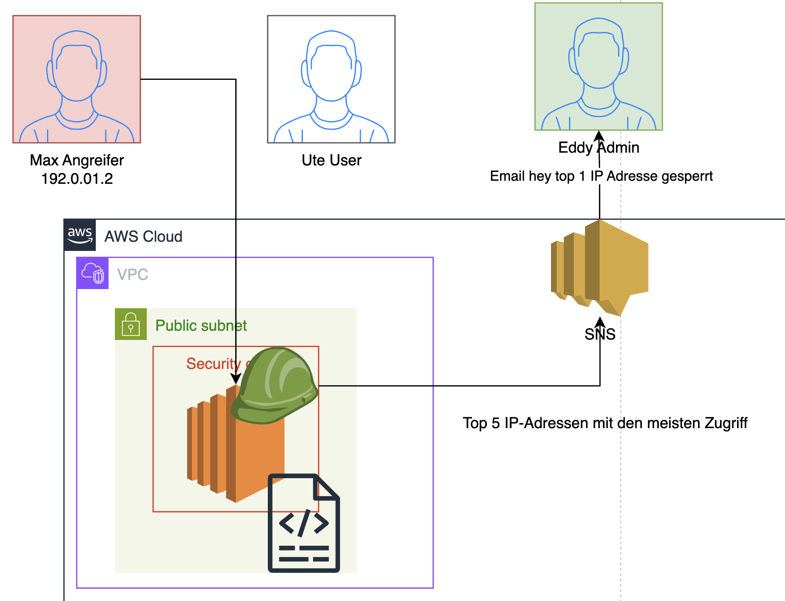
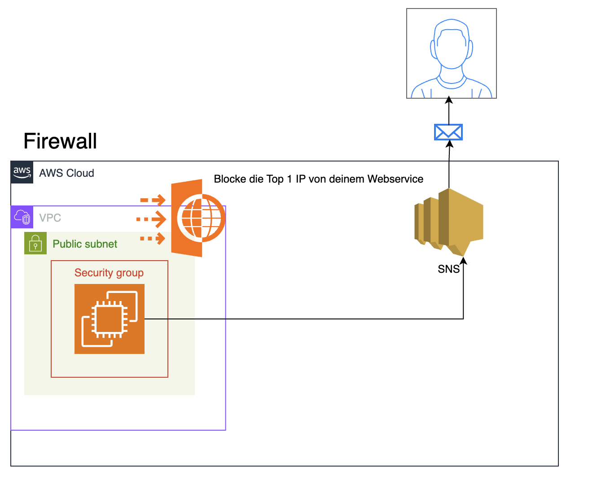

# EC2 Ubuntu mit Nginx und Log-Analyse

## Aufgabe 1: EC2 Ubuntu Instanz mit Nginx starten
Pro Team reicht eine EC2 Instanz, Ngnix Befehle können via Multipass lokal getestet werden.

1. Melde dich bei AWS an.
2. Starte eine EC2-Instanz.
3. Installiere und starte Nginx.
4. Überprüfe, dass Nginx weltweit erreichbar ist.

## Aufgabe 2: Log-Analyse mit Linux-Werkzeugen

Du hast nun Nginx laufen, die Access-Logs befinden sich standardmäßig in `/var/log/nginx/access.log`. Analysiere die Logs mit folgenden Linux-Kommandos: `awk`, `sort`, `uniq`, `head`, `grep`, `sed`.

Erstelle Befehle, um jeweils die Top 5 herauszufinden:

* **Top 5 IP-Adressen mit den meisten Zugriffen**
* **Top 5 angefragte Pfade** 
* **Top 5 HTTP-Statuscodes**
* **Top 5 User Agents**

## Aufgabe 3: Ergebnisse per SNS verschicken

1. Erstelle ein SNS Topic.
2. Abonniere deine E-Mail-Adresse.
3. Schicke die Ergebnisse der Log-Analyse als Nachricht an das SNS Topic.

## Stufe 2: Automatisierte Ausführung

Richte eine Automatisierung ein, die alle 10 Minuten die Log-Analyse durchführt und die Ergebnisse per SNS verschickt.

## Stufe 3: IP-Sperre im VPC

Nutze eine AWS-eigene Methode im VPC, um die IP-Adresse mit den meisten Zugriffen zu sperren.

## Stufe 4: Ngnix Seiten sperren

Konfiguriere eine HTML Seite die unter /sperre erreichbar ist. Finde heraus wie in Ngnix der Zugang zu einzelnen Seiten gesperrt werden kann.