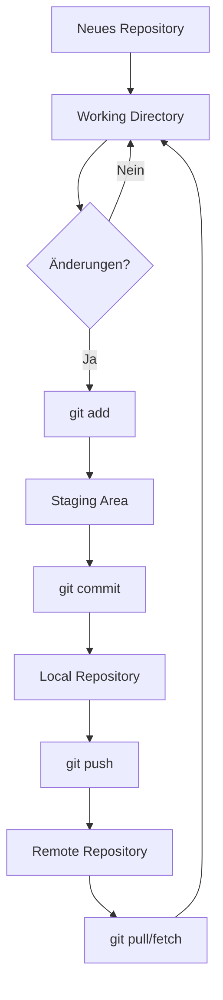
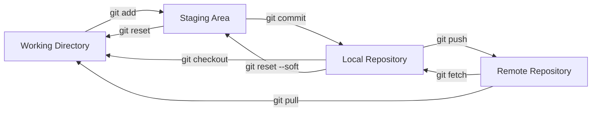

# Git Grundlagen - Umfassende Einführung

## Inhaltsverzeichnis
1. [Was ist Git?](#was-ist-git)
2. [Warum Git verwenden?](#warum-git-verwenden)
3. [Grundkonzepte](#grundkonzepte)
4. [Installation und Konfiguration](#installation-und-konfiguration)
5. [Der Git-Workflow](#der-git-workflow)
6. [Wichtige Git-Befehle](#wichtige-git-befehle)
7. [Branching und Merging](#branching-und-merging)
8. [Remote Repositories](#remote-repositories)
9. [Praktische Übungen](#praktische-übungen)
10. [Best Practices](#best-practices)
11. [Häufige Probleme und Lösungen](#häufige-probleme-und-lösungen)

---

## Was ist Git?

Git ist ein **verteiltes Versionskontrollsystem** (Distributed Version Control System - DVCS), das 2005 von Linus Torvalds für die Entwicklung des Linux-Kernels erstellt wurde.

### Kernmerkmale:
- **Verteilt**: Jeder Entwickler hat eine vollständige Kopie des Repositories
- **Schnell**: Optimiert für Performance, auch bei großen Projekten
- **Branching**: Einfaches Erstellen und Zusammenführen von Entwicklungszweigen
- **Integrität**: Kryptographische Sicherung aller Daten durch SHA-1-Hashes
- **Open Source**: Kostenlos und frei verfügbar

### Git vs. andere Versionskontrollsysteme

| Feature | Git | SVN | CVS |
|---------|-----|-----|-----|
| Architektur | Verteilt | Zentralisiert | Zentralisiert |
| Offline-Arbeit | ✓ Vollständig | ✗ Eingeschränkt | ✗ Nicht möglich |
| Branching | Schnell & einfach | Langsam | Kompliziert |
| Performance | Sehr schnell | Mittel | Langsam |
| Speicherplatz | Effizient | Mittel | Ineffizient |

---

## Warum Git verwenden?

### 1. **Zusammenarbeit**
- Mehrere Entwickler können gleichzeitig am selben Projekt arbeiten
- Konflikte werden automatisch erkannt und können gelöst werden
- Code-Reviews durch Pull/Merge Requests

### 2. **Versionierung**
- Vollständige Historie aller Änderungen
- Rückkehr zu jedem beliebigen Stand möglich
- Nachvollziehbarkeit: Wer hat wann was geändert?

### 3. **Backup**
- Verteilte Natur = mehrere Backups
- Keine Single Point of Failure
- Einfache Wiederherstellung

### 4. **Experimente**
- Branches für neue Features oder Experimente
- Fehler betreffen nicht die Hauptentwicklung
- Einfaches Verwerfen gescheiterter Experimente

---

## Grundkonzepte

### Die drei Bereiche von Git

```
Arbeitsverzeichnis     Staging Area        Repository
(Working Directory)    (Index)             (.git)
       |                    |                  |
       |                    |                  |
   [Dateien]            [Vorgemerkte      [Gespeicherte
                         Änderungen]        Versionen]
       |                    |                  |
       |---- git add ----->|                  |
       |                    |-- git commit -->|
       |<----------- git checkout ------------|
```

### 1. **Working Directory (Arbeitsverzeichnis)**
- Enthält die aktuellen Dateien, an denen Sie arbeiten
- Änderungen hier sind noch nicht von Git erfasst

### 2. **Staging Area (Index)**
- Zwischenbereich für Änderungen, die committed werden sollen
- Ermöglicht selektives Committen von Änderungen

### 3. **Repository (.git)**
- Enthält alle Commits, Branches und die komplette Historie
- Versteckter `.git` Ordner im Projektverzeichnis

### Dateizustände in Git

```
Untracked ──────> Unmodified ──────> Modified ──────> Staged
    |                  |                  |              |
    |                  |                  |              |
    └── git add ──────┴──────────────────┴──────────────┘
                       |                                 |
                       └──────── git commit ─────────────┘
```

1. **Untracked**: Datei ist Git noch nicht bekannt
2. **Unmodified**: Datei ist committed und unverändert
3. **Modified**: Datei wurde geändert, aber noch nicht gestaged
4. **Staged**: Änderungen sind für den nächsten Commit vorgemerkt

---

## Installation und Konfiguration

### Installation

#### Ubuntu/Debian:
```bash
sudo apt update
sudo apt install git
```

#### macOS:
```bash
# Mit Homebrew
brew install git

# Oder Xcode Command Line Tools
xcode-select --install
```

#### Windows:
- Download von [git-scm.com](https://git-scm.com/)
- Git Bash wird mitinstalliert

### Grundkonfiguration

```bash
# Benutzername setzen (global für alle Repositories)
git config --global user.name "Ihr Name"

# E-Mail setzen
git config --global user.email "ihre.email@example.com"

# Editor festlegen
git config --global core.editor "nano"  # oder vim, code, etc.

# Farbige Ausgabe aktivieren
git config --global color.ui auto

# Zeilenenden-Behandlung (Windows)
git config --global core.autocrlf true

# Zeilenenden-Behandlung (Linux/Mac)
git config --global core.autocrlf input

# Konfiguration anzeigen
git config --list
git config --global --list
```

### Nützliche Aliase

```bash
# Kurzbefehle einrichten
git config --global alias.st status
git config --global alias.co checkout
git config --global alias.br branch
git config --global alias.ci commit
git config --global alias.unstage 'reset HEAD --'
git config --global alias.last 'log -1 HEAD'
git config --global alias.visual '!gitk'
```

---

## Der Git-Workflow

### Typischer Arbeitsablauf

```
1. Repository erstellen oder klonen
   ↓
2. Änderungen vornehmen
   ↓
3. Änderungen zum Staging hinzufügen
   ↓
4. Commit erstellen
   ↓
5. Mit Remote synchronisieren
   ↓
6. Wiederholen ab Schritt 2
```

### Detaillierter Workflow



---

## Wichtige Git-Befehle

### Repository-Verwaltung

```bash
# Neues Repository erstellen
git init
git init projektname

# Repository klonen
git clone https://github.com/user/repo.git
git clone https://github.com/user/repo.git neuer-name

# Status anzeigen
git status
git status -s  # Kurzform

# Hilfe zu Befehlen
git help <befehl>
git <befehl> --help
man git-<befehl>
```

### Änderungen verwalten

```bash
# Dateien zum Staging hinzufügen
git add datei.txt
git add *.js
git add .  # Alle Änderungen
git add -A  # Alle Änderungen inkl. Löschungen
git add -p  # Interaktiv (teilweise Änderungen)

# Änderungen committen
git commit -m "Beschreibung der Änderungen"
git commit  # Öffnet Editor für längere Nachricht
git commit -a -m "Message"  # Add + Commit für tracked files
git commit --amend  # Letzten Commit ändern

# Unterschiede anzeigen
git diff  # Working Directory vs. Staging
git diff --staged  # Staging vs. letzter Commit
git diff HEAD  # Working Directory vs. letzter Commit
git diff commit1 commit2  # Zwischen zwei Commits
```

### Historie erkunden

```bash
# Commit-Historie anzeigen
git log
git log --oneline  # Kompakte Ansicht
git log --graph  # Mit Branch-Visualisierung
git log --graph --oneline --all  # Übersichtlich
git log -n 5  # Letzte 5 Commits
git log --since="2 weeks ago"
git log --author="Name"
git log --grep="bugfix"
git log -- datei.txt  # Historie einer Datei

# Detaillierte Commit-Informationen
git show  # Letzter Commit
git show commit-hash
git show branch:datei.txt  # Dateiinhalt in Branch

# Wer hat was geändert?
git blame datei.txt
```

### Änderungen rückgängig machen

```bash
# Datei auf letzten Commit zurücksetzen
git checkout -- datei.txt
git restore datei.txt  # Neuer Befehl (Git 2.23+)

# Staging rückgängig machen
git reset HEAD datei.txt
git restore --staged datei.txt  # Neuer Befehl

# Commits rückgängig machen
git reset --soft HEAD~1  # Letzten Commit rückgängig, Änderungen bleiben
git reset --mixed HEAD~1  # Default, Änderungen in Working Directory
git reset --hard HEAD~1  # VORSICHT: Löscht Änderungen komplett!

# Commit rückgängig machen (sicher)
git revert commit-hash  # Erstellt neuen Commit der Änderungen rückgängig macht
```

---

## Branching und Merging

### Was sind Branches?

Branches sind parallele Entwicklungslinien in Ihrem Projekt:

```
main    ──●──●──●──────────────●──●── (Hauptentwicklung)
           \                  /
feature     ●──●──●──●──●──●─ (Feature-Entwicklung)
```

### Branch-Verwaltung

```bash
# Branches anzeigen
git branch  # Lokale Branches
git branch -r  # Remote Branches
git branch -a  # Alle Branches
git branch -v  # Mit letztem Commit

# Branch erstellen
git branch feature-xyz
git checkout -b feature-xyz  # Erstellen und wechseln
git switch -c feature-xyz  # Neuer Befehl (Git 2.23+)

# Branch wechseln
git checkout feature-xyz
git switch feature-xyz  # Neuer Befehl

# Branch löschen
git branch -d feature-xyz  # Nur wenn gemerged
git branch -D feature-xyz  # Erzwingen

# Branch umbenennen
git branch -m alter-name neuer-name
git branch -m neuer-name  # Aktuellen Branch
```

### Merging

```bash
# Branch mergen
git checkout main
git merge feature-xyz

# Merge-Strategien
git merge --no-ff feature  # Immer Merge-Commit erstellen
git merge --ff-only feature  # Nur Fast-Forward
git merge --squash feature  # Alle Commits zu einem zusammenfassen

# Merge-Konflikte lösen
# 1. Konfliktdateien manuell bearbeiten
# 2. git add konflikt-datei.txt
# 3. git commit
```

### Merge-Konflikt Beispiel

```
<<<<<<< HEAD
Diese Zeile wurde in main geändert
=======
Diese Zeile wurde im Feature-Branch geändert
>>>>>>> feature-xyz
```

### Rebase (Fortgeschritten)

```bash
# History linear halten
git checkout feature
git rebase main

# Interaktives Rebase
git rebase -i HEAD~3  # Letzte 3 Commits bearbeiten

# VORSICHT: Nie öffentliche Commits rebasen!
```

---

## Remote Repositories

### Verbindung zu Remote Repositories

```bash
# Remote hinzufügen
git remote add origin https://github.com/user/repo.git

# Remotes anzeigen
git remote
git remote -v  # Mit URLs

# Remote ändern
git remote set-url origin neue-url

# Remote entfernen
git remote remove origin
git remote rm origin
```

### Synchronisation

```bash
# Änderungen hochladen
git push origin main
git push -u origin main  # Upstream setzen
git push  # Wenn Upstream gesetzt

# Änderungen herunterladen
git fetch origin  # Nur Informationen holen
git pull origin main  # Fetch + Merge
git pull  # Wenn Upstream gesetzt

# Alle Branches pushen
git push --all origin

# Tags pushen
git push --tags
```

### GitHub/GitLab/Bitbucket Workflow

```bash
# 1. Repository forken (auf GitHub)
# 2. Fork klonen
git clone https://github.com/ihr-name/repo.git

# 3. Upstream hinzufügen
git remote add upstream https://github.com/original/repo.git

# 4. Feature-Branch erstellen
git checkout -b neue-funktion

# 5. Änderungen machen und committen
git add .
git commit -m "Neue Funktion hinzugefügt"

# 6. Zum Fork pushen
git push origin neue-funktion

# 7. Pull Request erstellen (auf GitHub)

# 8. Upstream-Änderungen einpflegen
git fetch upstream
git checkout main
git merge upstream/main
```

---

## Praktische Übungen

### Übung 1: Erstes Repository

```bash
# 1. Erstellen Sie ein neues Verzeichnis
mkdir mein-erstes-repo
cd mein-erstes-repo

# 2. Initialisieren Sie Git
git init

# 3. Erstellen Sie eine README.md
echo "# Mein erstes Git Repository" > README.md
echo "Dies ist ein Übungsprojekt zum Git lernen." >> README.md

# 4. Status prüfen
git status

# 5. Datei zum Staging hinzufügen
git add README.md

# 6. Ersten Commit erstellen
git commit -m "Initialer Commit mit README"

# 7. Historie anzeigen
git log
```

### Übung 2: Änderungen und Commits

```bash
# 1. Neue Datei erstellen
echo "print('Hallo Git!')" > hello.py

# 2. README erweitern
echo "## Dateien" >> README.md
echo "- hello.py: Einfaches Python-Skript" >> README.md

# 3. Status prüfen
git status

# 4. Beide Dateien stagen
git add .

# 5. Unterschiede anzeigen
git diff --staged

# 6. Commit erstellen
git commit -m "Python-Skript hinzugefügt und README aktualisiert"

# 7. Weitere Änderung
echo "print('Git ist toll!')" >> hello.py

# 8. Nur eine Datei committen
git add hello.py
git commit -m "Zusätzliche Ausgabe in hello.py"
```

### Übung 3: Branching

```bash
# 1. Aktuellen Branch anzeigen
git branch

# 2. Neuen Feature-Branch erstellen
git checkout -b feature-login

# 3. Neue Datei im Branch erstellen
echo "def login(username, password):" > login.py
echo "    return True  # TODO: Implementieren" >> login.py

# 4. Änderungen committen
git add login.py
git commit -m "Login-Funktion Grundgerüst erstellt"

# 5. Zurück zum main-Branch
git checkout main

# 6. Dateien vergleichen
ls  # login.py ist nicht da!

# 7. Feature-Branch mergen
git merge feature-login

# 8. Branch löschen
git branch -d feature-login
```

### Übung 4: Merge-Konflikt lösen

```bash
# 1. Setup
echo "Version 1.0" > version.txt
git add version.txt
git commit -m "Version 1.0"

# 2. Feature-Branch erstellen
git checkout -b feature-a
echo "Version 1.1-feature-a" > version.txt
git commit -am "Version für Feature A"

# 3. Zurück zu main und andere Änderung
git checkout main
echo "Version 1.1-hotfix" > version.txt
git commit -am "Hotfix Version"

# 4. Merge versuchen (Konflikt!)
git merge feature-a

# 5. Konflikt in version.txt lösen
# Datei manuell bearbeiten, dann:
git add version.txt
git commit -m "Merge-Konflikt gelöst"
```

### Übung 5: Remote Repository

```bash
# 1. GitHub-Repository erstellen (im Browser)

# 2. Remote hinzufügen
git remote add origin https://github.com/ihr-name/test-repo.git

# 3. Ersten Push
git push -u origin main

# 4. README online ändern (GitHub Editor)

# 5. Änderungen pullen
git pull origin main

# 6. Lokale Änderung
echo "Lokale Änderung" >> README.md
git commit -am "Lokale Änderung hinzugefügt"

# 7. Push
git push
```

### Übung 6: Git Alias und Konfiguration

```bash
# 1. Nützliche Aliase einrichten
git config --global alias.ll "log --oneline --graph --all"
git config --global alias.st "status -s"
git config --global alias.co checkout
git config --global alias.br branch
git config --global alias.unstage "reset HEAD --"

# 2. Testen
git ll
git st

# 3. Globale .gitignore
echo "*.log" > ~/.gitignore_global
echo ".DS_Store" >> ~/.gitignore_global
echo "*.swp" >> ~/.gitignore_global
git config --global core.excludesfile ~/.gitignore_global
```

### Übung 7: Interaktives Staging

```bash
# 1. Datei mit mehreren Änderungen erstellen
cat > story.txt << EOF
Es war einmal ein Git Repository.
Es lebte auf einem Server.
Viele Entwickler arbeiteten daran.
Sie waren alle glücklich.
EOF
git add story.txt
git commit -m "Geschichte begonnen"

# 2. Mehrere Änderungen machen
sed -i '2s/lebte/wohnte/' story.txt
sed -i '4s/glücklich/sehr glücklich/' story.txt
echo "Und sie committeten für immer." >> story.txt

# 3. Interaktiv stagen
git add -p story.txt
# y = diese Änderung stagen
# n = diese Änderung nicht stagen
# s = Änderung aufteilen (wenn möglich)
# q = beenden
```

### Übung 8: Historie umschreiben (Fortgeschritten)

```bash
# VORSICHT: Nur bei lokalen Commits!

# 1. Mehrere Commits erstellen
echo "Feature 1" > feature1.txt
git add . && git commit -m "WIP: Feature 1"

echo "Feature 1 fertig" >> feature1.txt
git commit -am "Feature 1 fertiggestellt"

echo "Tippfehler" >> feature1.txt
git commit -am "Tippfehler korrigiert"

# 2. Letzte 3 Commits interaktiv bearbeiten
git rebase -i HEAD~3
# Im Editor:
# - pick = Commit behalten
# - reword = Commit-Message ändern
# - squash = Mit vorherigem Commit zusammenfassen
# - drop = Commit verwerfen

# 3. Commits zusammenfassen (squash)
# Ändern Sie "pick" zu "squash" für die letzten beiden
```

---

## Best Practices

### 1. **Commit-Messages**

```bash
# Gute Commit-Message
git commit -m "Fix: Behebt Absturz beim Login mit leerem Passwort

- Validierung für leere Eingaben hinzugefügt
- Fehlermeldung für Benutzer verbessert
- Unit-Tests für Edge-Cases ergänzt

Fixes #123"

# Schlechte Commit-Message
git commit -m "Änderungen"  # Nicht aussagekräftig
git commit -m "asdf"  # Bedeutungslos
```

#### Commit-Message-Format:
```
<Typ>: <Kurze Zusammenfassung> (max. 50 Zeichen)

<Ausführliche Beschreibung, falls nötig>
(Nach Leerzeile, max. 72 Zeichen pro Zeile)

<Footer mit Referenzen>
Fixes #123, Closes #456
```

Typen:
- `feat`: Neue Funktion
- `fix`: Bugfix
- `docs`: Dokumentation
- `style`: Formatierung (keine Funktionsänderung)
- `refactor`: Code-Umstrukturierung
- `test`: Tests hinzugefügt/geändert
- `chore`: Wartungsarbeiten

### 2. **Branching-Strategien**

#### Git Flow
```
main
  ├── develop
  │     ├── feature/login
  │     ├── feature/payment
  │     └── feature/search
  ├── release/1.0
  └── hotfix/security-patch
```

#### GitHub Flow (einfacher)
```
main
  ├── feature/new-feature
  ├── fix/bug-123
  └── update/documentation
```

### 3. **.gitignore richtig nutzen**

```bash
# .gitignore Beispiel
# Betriebssystem
.DS_Store
Thumbs.db
*.swp

# IDE
.vscode/
.idea/
*.sublime-*

# Dependencies
node_modules/
vendor/
__pycache__/

# Build-Artefakte
dist/
build/
*.pyc
*.class

# Logs
*.log
logs/

# Umgebungsvariablen
.env
.env.local

# Aber committen:
!.env.example
```

### 4. **Regelmäßig committen**
- Kleine, atomare Commits
- Ein Commit = eine logische Änderung
- Lieber öfter committen als zu selten

### 5. **Vor dem Push**
```bash
# Code nochmal durchsehen
git diff origin/main

# Tests laufen lassen
npm test  # oder äquivalent

# Linter ausführen
npm run lint

# Commits aufräumen (optional)
git rebase -i origin/main
```

---

## Häufige Probleme und Lösungen

### Problem 1: Falschen Commit rückgängig machen

```bash
# Letzten Commit rückgängig, Änderungen behalten
git reset --soft HEAD~1

# Letzten Commit komplett verwerfen
git reset --hard HEAD~1

# Commit in öffentlichem Branch rückgängig
git revert <commit-hash>
```

### Problem 2: Auf falschem Branch gearbeitet

```bash
# Änderungen noch nicht committed
git stash
git checkout richtiger-branch
git stash pop

# Bereits committed
git checkout richtiger-branch
git cherry-pick <commit-hash>
git checkout falscher-branch
git reset --hard HEAD~1
```

### Problem 3: Datei aus Git entfernen, aber behalten

```bash
# Datei aus Git entfernen, aber im Dateisystem behalten
git rm --cached datei.txt
echo "datei.txt" >> .gitignore
git commit -m "Datei aus Versionskontrolle entfernt"
```

### Problem 4: Große Dateien committed

```bash
# Wenn noch nicht gepusht
git reset --soft HEAD~1
git reset HEAD große-datei.bin
echo "*.bin" >> .gitignore
git add .gitignore
git commit -m "Große Datei entfernt und ignoriert"

# Wenn bereits gepusht (benötigt git-filter-branch oder BFG)
# Warnung: Ändert die Historie!
```

### Problem 5: Merge-Konflikt

```bash
# Konflikt-Dateien finden
git status

# Konflikte lösen (manuell editieren)
# Dann:
git add konflikt-datei.txt
git commit

# Oder Merge abbrechen
git merge --abort
```

### Problem 6: Detached HEAD

```bash
# Was ist passiert?
git status  # HEAD detached at abc123

# Zurück zu einem Branch
git checkout main

# Änderungen behalten
git checkout -b neuer-branch
```

---

## Git Workflow Diagramm



---

## Weiterführende Ressourcen

### Offizielle Dokumentation
- [Git Dokumentation](https://git-scm.com/doc)
- [Pro Git Buch (kostenlos)](https://git-scm.com/book/de/v2)

### Interaktive Tutorials
- [Learn Git Branching](https://learngitbranching.js.org/)
- [GitHub Learning Lab](https://lab.github.com/)
- [Atlassian Git Tutorial](https://www.atlassian.com/git)

### Cheat Sheets
- [GitHub Git Cheat Sheet](https://education.github.com/git-cheat-sheet-education.pdf)
- [GitLab Git Cheat Sheet](https://about.gitlab.com/images/press/git-cheat-sheet.pdf)

### GUI-Clients (optional)
- **GitKraken**: Plattformübergreifend, visuell
- **SourceTree**: Kostenlos von Atlassian
- **GitHub Desktop**: Einfach für GitHub-Projekte
- **VSCode**: Integrierte Git-Unterstützung

---

## Zusammenfassung

Git ist ein mächtiges Werkzeug, das anfangs überwältigend wirken kann. Die wichtigsten Konzepte sind:

1. **Die drei Bereiche**: Working Directory, Staging Area, Repository
2. **Basis-Workflow**: add → commit → push → pull
3. **Branching**: Parallele Entwicklung ermöglichen
4. **Remote Repositories**: Zusammenarbeit mit anderen

Mit diesen Grundlagen und regelmäßiger Übung werden Sie schnell sicher im Umgang mit Git. Denken Sie daran:
- Committen Sie oft und mit aussagekräftigen Messages
- Nutzen Sie Branches für neue Features
- Halten Sie Ihre Repositories sauber mit .gitignore
- Scheuen Sie sich nicht, Hilfe zu suchen mit `git help`

Happy Coding! 🚀