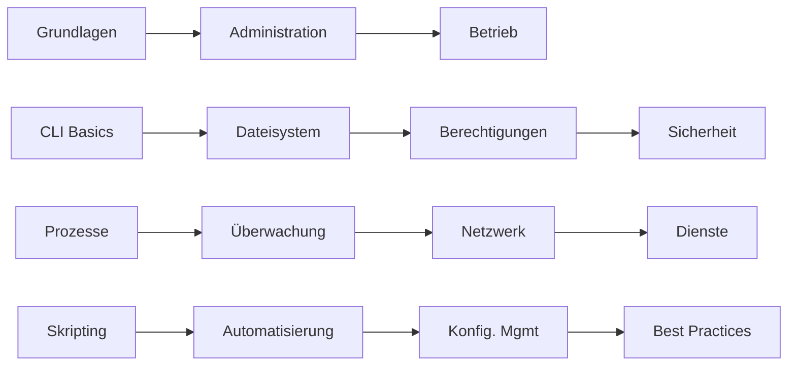

# Linux 101: Detailliertes Curriculum (108 Stunden)

## Lernpfad-Übersicht

## Monat 1: Linux-Grundlagen (36 Stunden)

### Woche 1: Erste Schritte (9 Stunden)
**Tag 1 (3h): Einführung & Bewertung**
- Studentenpräsentationen: "Mein liebster Linux-Befehl"
- Kursübersicht und Erwartungen
- VM-Setup-Verifizierung

**Tag 2 (3h): Linux-Geschichte & Architektur**
- Warum Linux im Betrieb?
- Distributionsübersicht (Fokus: Ubuntu)
- Linux vs Unix vs Windows
- Kernel, Shell und User Space
- **Labor**: Erster Boot und Erkundung

**Tag 3 (3h): Wesentliche Befehle I**
- Navigation: pwd, cd, ls
- Hilfe erhalten: man, info, --help, type
- Grundlegende Dateioperationen: touch, cp, mv, rm, mkdir
- **Labor**: Kommandozeilen-Schatzsuche

### Woche 2: Kommandozeilen-Meisterschaft (9 Stunden)
**Tag 4 (3h): Wesentliche Befehle II**
- Text anzeigen: cat, less, head, tail
- Text durchsuchen: grep, find
- Pipes und Umleitung: |, >, >>, <
- **Labor**: Log-Datei-Untersuchung

**Tag 5 (3h): Textverarbeitung**
- Texteditoren: nano, vim Grundlagen
- Stream-Bearbeitung: sed, awk Grundlagen
- cut, sort, uniq, wc
- **Labor**: Datenextraktions-Herausforderung

**Tag 6 (3h): Fortgeschrittene CLI**
- Befehlsverlauf und Tastenkürzel
- Aliase und .bashrc
- Umgebungsvariablen
- Job-Kontrolle: &, jobs, fg, bg
- **Labor**: Shell anpassen

### Woche 3: Dateisystem & Speicher (9 Stunden)
**Tag 7 (3h): Linux-Dateisystem**
- Dateisystemhierarchie (FHS)
- Wichtige Verzeichnisse: /etc, /var, /home, /tmp
- Dateitypen und Links
- **Labor**: System-Erkundungsquiz

**Tag 8 (3h): Speicherverwaltung**
- Festplattenpartitionen und Mount-Punkte
- df, du, lsblk, fdisk Grundlagen
- Dateisystemtypen: ext4, xfs
- **Labor**: Speicheranalyse

**Tag 9 (3h): Berechtigungs-Grundlagen**
- Benutzer und Gruppen
- Dateiberechtigungen: rwx
- chmod, chown, chgrp
- umask
- **Labor**: Sichere Dateifreigabe-Übung

### Woche 4: Sicherheits-Grundlagen (9 Stunden)
**Tag 10 (3h): Erweiterte Berechtigungen**
- Spezielle Berechtigungen: SUID, SGID, Sticky Bit
- Access Control Lists (ACLs)
- Dateiattribute: lsattr, chattr
- **Labor**: Mehrbenutzer-Szenario

**Tag 11 (3h): Benutzerverwaltung**
- useradd, usermod, userdel
- groupadd, groups
- passwd, shadow-Dateien
- sudo-Konfiguration
- **Labor**: Benutzeradministration

**Tag 12 (3h): Sicherheits-Best-Practices**
- SSH-Schlüsselverwaltung
- Dateiintegrität
- Grundlegende Firewall-Konzepte
- Sicherheits-Checkliste
- **Projekt**: System absichern

## Monat 2: Systemadministration (36 Stunden)

### Woche 5: Prozessmanagement (9 Stunden)
**Tag 13 (3h): Prozesse verstehen**
- Prozesslebenszyklus
- ps, top, htop
- Prozessprioritäten: nice, renice
- **Labor**: Prozessuntersuchung

**Tag 14 (3h): Prozesskontrolle**
- Signale: kill, killall, pkill
- Hintergrundprozesse
- nohup und screen/tmux Grundlagen
- **Labor**: Prozessmanagement-Szenarien

**Tag 15 (3h): Systemdienste**
- systemd-Grundlagen
- systemctl-Befehle
- Service-Units
- **Labor**: Service-Management

### Woche 6: Systemüberwachung (9 Stunden)
**Tag 16 (3h): Leistungsüberwachung**
- CPU-, Speicher-, Festplattenüberwachung
- vmstat, iostat, sar
- Load Average verstehen
- **Labor**: Leistungs-Baseline

**Tag 17 (3h): Log-Management**
- Systemlog-Speicherorte
- journalctl-Meisterschaft
- Log-Rotation
- Zentralisierte Logging-Konzepte
- **Labor**: Fehlerbehebung mit Logs

**Tag 18 (3h): Ressourcenverwaltung**
- Speicherverwaltung
- Swap-Konfiguration
- Speicherplatzverwaltung
- Prozesslimits
- **Labor**: Ressourcenoptimierung

### Woche 7: Netzwerk-Grundlagen (9 Stunden)
**Tag 19 (3h): Netzwerk-Basics**
- OSI-Modell für Ops
- IP-Adressierung und Subnetting
- Netzwerkschnittstellen
- ip, ifconfig-Befehle
- **Labor**: Netzwerkkonfiguration

**Tag 20 (3h): Netzwerk-Tools**
- ping, traceroute, mtr
- netstat, ss
- tcpdump-Grundlagen
- DNS-Tools: dig, nslookup
- **Labor**: Netzwerk-Fehlerbehebung

**Tag 21 (3h): Netzwerkdienste**
- SSH-Vertiefung
- Dateiübertragung: scp, rsync
- wget, curl
- Grundlegende Firewall mit ufw
- **Labor**: Sicherer Remote-Zugriff

### Woche 8: Service-Management (9 Stunden)
**Tag 22 (3h): Webdienste**
- Apache/Nginx-Grundlagen
- Virtual Hosts
- Grundlegendes SSL/TLS
- **Labor**: Webserver-Setup

**Tag 23 (3h): Datenbankdienste**
- MySQL/PostgreSQL-Grundlagen
- Backup-Strategien
- Grundlegende Leistungsoptimierung
- **Labor**: Datenbankoperationen

**Tag 24 (3h): Anwendungsbereitstellung**
- Paketverwaltung-Vertiefung
- Abhängigkeitsbehandlung
- Service-Integration
- **Projekt**: Webanwendung bereitstellen

## Monat 3: Betrieb & Automatisierung (36 Stunden)

### Woche 9: Shell-Skripting-Grundlagen (9 Stunden)
**Tag 25 (3h): Bash-Skripting-Einführung**
- Skriptstruktur
- Variablen und Parameter
- Ein-/Ausgabe
- **Labor**: Erste Skripte

**Tag 26 (3h): Kontrollstrukturen**
- Bedingungen: if, case
- Schleifen: for, while
- Funktionen
- **Labor**: Skript-Logik

**Tag 27 (3h): Praktisches Skripting**
- Fehlerbehandlung
- Skript-Debugging
- Best Practices
- **Labor**: Automatisierungsskripte

### Woche 10: Fortgeschrittene Automatisierung (9 Stunden)
**Tag 28 (3h): Fortgeschrittenes Skripting**
- Arrays und String-Manipulation
- Reguläre Ausdrücke
- Skript-Planung mit cron
- **Labor**: Komplexe Automatisierung

**Tag 29 (3h): Systemautomatisierung**
- Backup-Automatisierung
- Log-Analyse-Skripte
- Überwachungsskripte
- **Labor**: Operations-Toolkit

**Tag 30 (3h): Konfigurationsmanagement**
- Infrastructure as Code-Konzepte
- Ansible-Einführung
- Grundlegende Playbooks
- **Labor**: Konfigurationsautomatisierung

### Woche 11: DevOps-Praktiken (9 Stunden)
**Tag 31 (3h): Versionskontrolle**
- Git für Operations
- Konfigurationsversionierung
- Kollaborative Workflows
- **Labor**: Git-Operations

**Tag 32 (3h): CI/CD-Konzepte**
- Continuous Integration-Grundlagen
- Deployment-Strategien
- Pipeline-Konzepte
- **Labor**: Einfaches CI/CD

**Tag 33 (3h): Container-Grundlagen**
- Docker-Einführung
- Container vs VM
- Grundlegende Container-Operationen
- **Labor**: App containerisieren

### Woche 12: Abschlussprojekt & Best Practices (9 Stunden)
**Tag 34 (3h): Überwachung & Alarmierung**
- Überwachungs-Stack-Übersicht
- Metrik-Sammlung
- Alarm-Design
- **Labor**: Überwachungs-Setup

**Tag 35 (3h): Incident Response**
- Fehlerbehebungsmethodik
- Incident-Behandlung
- Dokumentationspraktiken
- **Labor**: Incident-Szenarien

**Tag 36 (3h): Abschlussprojekt**
- Vollständiges Infrastruktur-Setup
- Lösungen präsentieren
- Kurs-Retrospektive
- Nächste Schritte in der Linux-Reise

## Bewertungsstrategie

- **Wöchentliche Quizze**: Theoretisches Wissen testen
- **Labor-Abschluss**: Praktische Fähigkeitsverifizierung  
- **Mini-Projekte**: Praktische Anwendung
- **Abschlussprojekt**: Vollständiges Ops-Szenario
- **Peer-Reviews**: Kollaboratives Lernen

## Erfolgsmetriken

- Kommandozeilen-Kompetenz
- System-Fehlerbehebungsfähigkeit
- Sicherheitsbewusstsein
- Automatisierungsmindset
- Operations-Best-Practices