# Linux-Fehlerbehebungs-Szenarien

## Realwelt-Probleme zum Üben

Diese Szenarien simulieren häufige Probleme, denen Sie im Betrieb begegnen werden. Jedes hat Hinweise, aber versuchen Sie sie zuerst ohne zu lösen!

---

## 🔴 Szenario 1: "Berechtigung verweigert"
**Schwierigkeit**: Anfänger  
**Zeit**: 15 Minuten

### Das Problem
```bash
$ cd /var/log
$ cat syslog
cat: syslog: Berechtigung verweigert
```

### Ihre Mission
1. Verstehen, warum Sie die Datei nicht lesen können
2. Einen Weg finden, den Dateiinhalt anzuzeigen
3. Die Sicherheitsimplikationen erklären

### Untersuchungsschritte
```bash
# Dateiberechtigungen prüfen
ls -la /var/log/syslog

# Ihre Benutzergruppen prüfen
id

# Prüfen wer die Datei besitzt
# Verschiedene Ansätze versuchen
```

<details>
<summary>💡 Hinweise (klicken zum Erweitern)</summary>

1. Schauen Sie sich die Dateiberechtigungen und Besitzverhältnisse an
2. Einige Log-Dateien brauchen spezielle Privilegien
3. Denken Sie an `sudo`, aber verstehen Sie warum
4. Berücksichtigen Sie Gruppenmitgliedschaft

</details>

<details>
<summary>✅ Lösung</summary>

```bash
# Berechtigungen prüfen
ls -la /var/log/syslog
# Ausgabe: -rw-r----- 1 syslog adm 245632 Oct 28 10:15 /var/log/syslog

# Sie müssen in der 'adm' Gruppe sein oder sudo verwenden
sudo cat /var/log/syslog
# ODER
sudo usermod -a -G adm $USER
# Dann abmelden/anmelden
```

**Warum das wichtig ist**: Systemlogs enthalten sensible Informationen. Eingeschränkter Zugriff verhindert, dass normale Benutzer sicherheitsrelevante Daten sehen.

</details>

---

## 🔴 Szenario 2: "Befehl nicht gefunden"
**Schwierigkeit**: Anfänger  
**Zeit**: 20 Minuten

### Das Problem
```bash
$ tree
Befehl 'tree' nicht gefunden, kann aber installiert werden mit:
sudo apt install tree
```

### Ihre Mission
1. Verstehen, warum der Befehl nicht gefunden wird
2. Lernen, wie man fehlende Befehle installiert
3. Alternativen finden, wenn Sie nicht installieren können

### Untersuchungsschritte
```bash
# Prüfen ob Befehl anderswo existiert
which tree
type tree

# Ihren PATH prüfen
echo $PATH

# Ähnliche Befehle finden
# Nach Alternativen suchen
```

<details>
<summary>💡 Hinweise</summary>

1. Nicht alle Befehle sind vorinstalliert
2. Paketmanager installieren Software
3. Manchmal gibt es eingebaute Alternativen
4. Prüfen Sie ob es ein PATH-Problem ist

</details>

<details>
<summary>✅ Lösung</summary>

```bash
# Option 1: Paket installieren
sudo apt update
sudo apt install tree

# Option 2: Alternativen verwenden
ls -R | grep ":$" | sed -e 's/:$//' -e 's/[^-][^\/]*\//--/g' -e 's/^/   /' -e 's/-/|/'

# Option 3: Grundlegenden Tree mit find erstellen
find . -type d | sed -e "s/[^-][^\/]*\//  |/g" -e "s/|\([^ ]\)/|-\1/"

# Option 4: Prüfen ob installiert aber nicht im PATH
find / -name tree 2>/dev/null
```

**Lektion**: Haben Sie immer Alternativen. In Produktion haben Sie möglicherweise keine Installationsrechte.

</details>

---

## 🟡 Szenario 3: "Speicherplatz voll"
**Schwierigkeit**: Mittelstufe  
**Zeit**: 25 Minuten

### Das Problem
```bash
$ touch neuedatei.txt
touch: 'neuedatei.txt' kann nicht berührt werden: Kein Speicherplatz mehr auf dem Gerät
```

### Ihre Mission
1. Finden was Speicherplatz verbraucht
2. Sicher Platz freigeben
3. Zukünftige Vorkommnisse verhindern

### Untersuchungsbefehle
```bash
# Speichernutzung prüfen
df -h

# Große Dateien finden
# Große Verzeichnisse finden
# Nach häufigen Platzfressern suchen
```

<details>
<summary>💡 Hinweise</summary>

1. Beginnen Sie mit `df -h` um zu sehen welche Partition voll ist
2. Verwenden Sie `du` um in Verzeichnisse hineinzugehen
3. Häufige Verursacher: Logs, Cache, Downloads, Temp-Dateien
4. Seien Sie vorsichtig was Sie löschen!

</details>

<details>
<summary>✅ Lösung</summary>

```bash
# 1. Volle Partition identifizieren
df -h
# Zeigt: /dev/sda1 20G 20G 0 100% /

# 2. Große Verzeichnisse finden
sudo du -h / | sort -rh | head -20

# 3. Häufige Speicherwiederherstellung:
# Paket-Cache leeren
sudo apt clean

# Alte Logs löschen
sudo journalctl --vacuum-time=3d

# Große Dateien finden
sudo find / -type f -size +100M -exec ls -lh {} \; 2>/dev/null

# 4. Benutzer-Cache leeren
rm -rf ~/.cache/*

# 5. Alte Kernels entfernen (Ubuntu)
sudo apt autoremove

# Prävention:
# Log-Rotation einrichten
# Speichernutzung regelmäßig überwachen
# Alarme bei 80% voll einrichten
```

**Praxis-Tipp**: Lassen Sie Produktions-Festplatten niemals 100% erreichen. Setzen Sie Alarme bei 80% und 90%.

</details>

---

## 🟡 Szenario 4: "Netzwerk nicht erreichbar"
**Schwierigkeit**: Mittelstufe  
**Zeit**: 30 Minuten

### Das Problem
```bash
$ ping google.com
ping: google.com: Temporärer Fehler bei der Namensauflösung

$ ping 8.8.8.8
connect: Netzwerk ist nicht erreichbar
```

### Ihre Mission
1. Netzwerkkonnektivitätsprobleme diagnostizieren
2. Identifizieren ob es DNS-, Routing- oder Interface-Problem ist
3. Die Verbindung reparieren

### Diagnose-Tools
```bash
# Netzwerk-Interfaces prüfen
# Routing prüfen
# DNS prüfen
# Konnektivität auf verschiedenen Ebenen testen
```

<details>
<summary>💡 Hinweise</summary>

1. Beginnen Sie von unten: Ist Interface oben?
2. Können Sie localhost pingen? Gateway? Externe IP?
3. Ist es DNS oder Konnektivität?
4. Konfigurationsdateien prüfen

</details>

<details>
<summary>✅ Lösung</summary>

```bash
# 1. Interface-Status prüfen
ip addr show
# ODER
ifconfig -a

# 2. Interface hochfahren wenn unten
sudo ip link set eth0 up
# ODER
sudo ifconfig eth0 up

# 3. Prüfen ob Sie eine IP haben
# Wenn keine IP, eine anfordern:
sudo dhclient eth0

# 4. Routing-Tabelle prüfen
ip route show
# ODER
route -n

# 5. Standard-Gateway hinzufügen wenn fehlend
sudo ip route add default via 192.168.1.1

# 6. Konnektivitäts-Schichten testen:
ping 127.0.0.1          # Localhost
ping 192.168.1.1        # Gateway
ping 8.8.8.8            # Externe IP
ping google.com         # DNS-Auflösung

# 7. DNS reparieren wenn nötig
echo "nameserver 8.8.8.8" | sudo tee /etc/resolv.conf
```

**Debug-Strategie**: Arbeiten Sie immer Schicht für Schicht, von physisch bis Anwendung.

</details>

---

## 🔵 Szenario 5: "Hohe Systemlast"
**Schwierigkeit**: Fortgeschritten  
**Zeit**: 30 Minuten

### Das Problem
```bash
$ uptime
10:15:32 up 5 days, 2:33, 2 users, load average: 15.24, 14.87, 13.92

System ist sehr langsam!
```

### Ihre Mission
1. Identifizieren was hohe Last verursacht
2. Bestimmen ob es CPU, I/O oder etwas anderes ist
3. Das Problem sicher lösen

### Untersuchungs-Tools
```bash
# Laufende Prozesse prüfen
# Ressourcennutzung identifizieren
# Den Verursacher finden
# Angemessene Maßnahmen ergreifen
```

<details>
<summary>💡 Hinweise</summary>

1. Load Average beinhaltet CPU und I/O-Warten
2. Verwenden Sie `top` oder `htop` interaktiv
3. Suchen Sie nach durchgehenden Prozessen
4. Schauen Sie nach I/O-Engpässen
5. Berücksichtigen Sie die Anzahl der CPU-Kerne

</details>

<details>
<summary>✅ Lösung</summary>

```bash
# 1. CPU-Anzahl prüfen (Last von 15 bei 16 Kernen ist OK)
nproc

# 2. Interaktive Prozessüberwachung
top
# Drücken Sie: 
# - 'P' um nach CPU zu sortieren
# - 'M' um nach Speicher zu sortieren
# - 'k' um Prozess zu killen

# 3. I/O-Warten prüfen
iostat -x 1
# ODER
iotop  # Benötigt sudo

# 4. CPU-Fresser finden
ps aux | sort -nrk 3,3 | head -10

# 5. Speicher-Fresser finden
ps aux | sort -nrk 4,4 | head -10

# 6. Nach Zombie-Prozessen suchen
ps aux | grep defunct

# 7. Wenn Prozess hängt:
# Netter Weg
kill PID
# Zwangstötung
kill -9 PID

# 8. System-Logs nach Hinweisen prüfen
sudo journalctl -xe | tail -50

# Häufige Ursachen:
# - Durchgehende Skripte/Schleifen
# - Backup läuft während Geschäftszeiten
# - Speicherdruck verursacht Swap
# - Disk I/O Engpass
# - Fork-Bomben
```

**Profi-Tipp**: Hohe Last ist nicht immer schlecht - verstehen Sie zuerst Ihre Baseline.

</details>

---

## 🔵 Szenario 6: "Service startet nicht"
**Schwierigkeit**: Fortgeschritten  
**Zeit**: 25 Minuten

### Das Problem
```bash
$ sudo systemctl start myapp.service
Job für myapp.service fehlgeschlagen, da der Kontrollprozess mit Fehlercode beendet wurde.
Siehe "systemctl status myapp.service" und "journalctl -xe" für Details.
```

### Ihre Mission
1. Diagnostizieren warum Service fehlschlägt
2. Das zugrunde liegende Problem beheben
3. Sicherstellen dass Service beim Boot startet

<details>
<summary>💡 Hinweise</summary>

1. Prüfen Sie immer zuerst Status und Logs
2. Suchen Sie nach Konfigurationsfehlern
3. Prüfen Sie Abhängigkeiten
4. Verifizieren Sie Berechtigungen
5. Testen Sie manuell vor systemd

</details>

<details>
<summary>✅ Lösung</summary>

```bash
# 1. Service-Status prüfen
sudo systemctl status myapp.service

# 2. Detaillierte Logs prüfen
sudo journalctl -u myapp.service -n 50

# 3. Vollständige System-Logs prüfen
sudo journalctl -xe

# 4. Häufige Probleme zu prüfen:

# a) Konfigurationsdatei-Syntax
sudo nginx -t  # Für nginx
sudo apache2ctl configtest  # Für apache

# b) Port bereits in Verwendung
sudo ss -tlnp | grep :80
sudo lsof -i :80

# c) Berechtigungsprobleme
ls -la /pfad/zur/app
sudo -u appuser /pfad/zur/app  # Als Service-Benutzer testen

# d) Fehlende Abhängigkeiten
ldd /pfad/zur/binary  # Bibliotheken prüfen

# e) SELinux/AppArmor (wenn aktiviert)
sudo ausearch -m AVC  # SELinux
sudo aa-status  # AppArmor

# 5. Manuell testen
sudo -u serviceuser /usr/bin/myapp

# 6. Reparieren und neu starten
sudo systemctl daemon-reload  # Wenn Unit-Datei geändert
sudo systemctl restart myapp.service

# 7. Beim Boot aktivieren
sudo systemctl enable myapp.service
```

**Denken Sie daran**: Services scheitern aus vielen Gründen. Systematisches Debugging spart Zeit.

</details>

---

## 📊 Fehlerbehebungs-Methodik

### Der universelle Prozess

```mermaid
graph TD
    A[Problem gemeldet] --> B{Problem reproduzieren}
    B -->|Ja| C[Informationen sammeln]
    B -->|Nein| D[Mehr Details bekommen]
    D --> B
    
    C --> E[Hypothese bilden]
    E --> F[Hypothese testen]
    F --> G{Problem gelöst?}
    
    G -->|Nein| H[Neue Hypothese]
    H --> F
    
    G -->|Ja| I[Lösung dokumentieren]
    I --> J[Prävention implementieren]
```



### Goldene Regeln
1. **Keine Panik** - Die meisten Probleme haben einfache Lösungen
2. **Fehler sorgfältig lesen** - Sie sagen meist was falsch ist
3. **Eine Sache nach der anderen ändern** - Variablen isolieren
4. **Alles dokumentieren** - Das zukünftige Ich wird danken
5. **Backups haben** - Vor Änderungen
6. **Wissen wie rückgängig machen** - Immer einen Rollback-Plan haben

---

## 🎮 Übungsmodus

### Täglicher Challenge-Generator
Jeden Tag etwas (sicher) kaputt machen und reparieren:

**Montag**: Berechtigungsprobleme
```bash
chmod 000 testdatei && echo "Jetzt reparieren!"
```

**Dienstag**: Netzwerkprobleme
```bash
sudo ip link set eth0 down && echo "Konnektivität wiederherstellen!"
```

**Mittwoch**: Speicherplatz
```bash
dd if=/dev/zero of=grossedatei bs=1M count=1000 && echo "Aufräumen!"
```

**Donnerstag**: Prozessprobleme
```bash
while true; do echo "CPU-Fresser" > /dev/null; done &
```

**Freitag**: Service-Mysterien
```bash
sudo systemctl stop ssh && echo "Remote-Zugriff reparieren!"
```

---

## 📚 Zusätzliche Szenarien für Selbststudium

1. **Korrupte PATH-Variable**
2. **Zeitzone-Fehlkonfiguration**
3. **Kaputte Paket-Abhängigkeiten**
4. **Dateisystem nur-lesbar**
5. **DNS-Auflösungsschleife**
6. **Memory-Leak-Untersuchung**
7. **Cron-Job läuft nicht**
8. **SSH-Schlüssel-Authentifizierung fehlgeschlagen**
9. **Firewall blockiert Verkehr**
10. **Log-Rotation fehlgeschlagen**

Jedes Szenario lehrt verschiedene Fähigkeiten. Üben Sie in einer VM wo Sie sicher Dinge kaputt machen können!

---

**Denken Sie daran**: Jeder Experte war einmal ein Anfänger, der keine Angst hatte, Dinge kaputt zu machen (in Testumgebungen)!