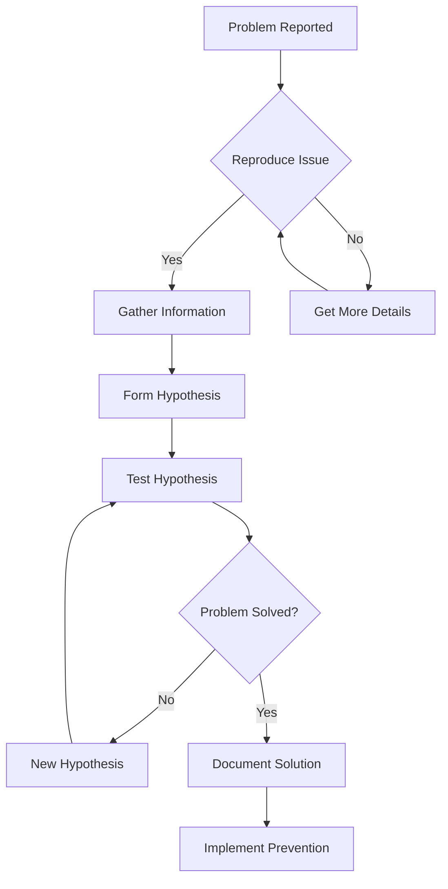

# Linux Troubleshooting Scenarios

## Real-World Problems for Practice

These scenarios simulate common issues you'll face in operations. Each has hints but try solving without them first!

---

## 🔴 Scenario 1: "Permission Denied"
**Difficulty**: Beginner  
**Time**: 15 minutes

### The Problem
```bash
$ cd /var/log
$ cat syslog
cat: syslog: Permission denied
```

### Your Mission
1. Understand why you can't read the file
2. Find a way to view the file contents
3. Explain the security implications

### Investigation Steps
```bash
# Check file permissions
ls -la /var/log/syslog

# Check your user groups
id

# Check who owns the file
# Try different approaches
```

<details>
<summary>💡 Hints (click to expand)</summary>

1. Look at the file permissions and ownership
2. Some log files need special privileges
3. Think about using `sudo` but understand why
4. Consider group membership

</details>

<details>
<summary>✅ Solution</summary>

```bash
# Check permissions
ls -la /var/log/syslog
# Output: -rw-r----- 1 syslog adm 245632 Oct 28 10:15 /var/log/syslog

# You need to be in 'adm' group or use sudo
sudo cat /var/log/syslog
# OR
sudo usermod -a -G adm $USER
# Then logout/login
```

**Why this matters**: System logs contain sensitive information. Restricted access prevents regular users from seeing security-relevant data.

</details>

---

## 🔴 Scenario 2: "Command Not Found"
**Difficulty**: Beginner  
**Time**: 20 minutes

### The Problem
```bash
$ tree
Command 'tree' not found, but can be installed with:
sudo apt install tree
```

### Your Mission
1. Understand why the command isn't found
2. Learn how to install missing commands
3. Find alternatives if you can't install

### Investigation Steps
```bash
# Check if command exists elsewhere
which tree
type tree

# Check your PATH
echo $PATH

# Find similar commands
# Look for alternatives
```

<details>
<summary>💡 Hints</summary>

1. Not all commands come pre-installed
2. Package managers install software
3. Sometimes there are built-in alternatives
4. Check if it's a PATH issue

</details>

<details>
<summary>✅ Solution</summary>

```bash
# Option 1: Install the package
sudo apt update
sudo apt install tree

# Option 2: Use alternatives
ls -R | grep ":$" | sed -e 's/:$//' -e 's/[^-][^\/]*\//--/g' -e 's/^/   /' -e 's/-/|/'

# Option 3: Create basic tree with find
find . -type d | sed -e "s/[^-][^\/]*\//  |/g" -e "s/|\([^ ]\)/|-\1/"

# Option 4: Check if installed but not in PATH
find / -name tree 2>/dev/null
```

**Lesson**: Always have alternatives. In production, you might not have install privileges.

</details>

---

## 🟡 Scenario 3: "Disk Space Full"
**Difficulty**: Intermediate  
**Time**: 25 minutes

### The Problem
```bash
$ touch newfile.txt
touch: cannot touch 'newfile.txt': No space left on device
```

### Your Mission
1. Find what's using disk space
2. Safely free up space
3. Prevent future occurrences

### Investigation Commands
```bash
# Check disk usage
df -h

# Find large files
# Find large directories
# Check for common space wasters
```

<details>
<summary>💡 Hints</summary>

1. Start with `df -h` to see which partition is full
2. Use `du` to drill down into directories
3. Common culprits: logs, cache, downloads, temp files
4. Be careful what you delete!

</details>

<details>
<summary>✅ Solution</summary>

```bash
# 1. Identify full partition
df -h
# Shows: /dev/sda1 20G 20G 0 100% /

# 2. Find large directories
sudo du -h / | sort -rh | head -20

# 3. Common space recovery:
# Clean package cache
sudo apt clean

# Clear old logs
sudo journalctl --vacuum-time=3d

# Find large files
sudo find / -type f -size +100M -exec ls -lh {} \; 2>/dev/null

# 4. Clean user cache
rm -rf ~/.cache/*

# 5. Remove old kernels (Ubuntu)
sudo apt autoremove

# Prevention:
# Set up log rotation
# Monitor disk usage regularly
# Set up alerts at 80% full
```

**Real-world tip**: Never let production disks hit 100%. Set alerts at 80% and 90%.

</details>

---

## 🟡 Scenario 4: "Network Unreachable"
**Difficulty**: Intermediate  
**Time**: 30 minutes

### The Problem
```bash
$ ping google.com
ping: google.com: Temporary failure in name resolution

$ ping 8.8.8.8
connect: Network is unreachable
```

### Your Mission
1. Diagnose network connectivity issues
2. Identify if it's DNS, routing, or interface problem
3. Fix the connection

### Diagnostic Tools
```bash
# Check network interfaces
# Check routing
# Check DNS
# Test connectivity at different levels
```

<details>
<summary>💡 Hints</summary>

1. Start from the bottom: Is interface up?
2. Can you ping localhost? Gateway? External IP?
3. Is it DNS or connectivity?
4. Check configuration files

</details>

<details>
<summary>✅ Solution</summary>

```bash
# 1. Check interface status
ip addr show
# OR
ifconfig -a

# 2. Bring interface up if down
sudo ip link set eth0 up
# OR
sudo ifconfig eth0 up

# 3. Check if you have an IP
# If no IP, request one:
sudo dhclient eth0

# 4. Check routing table
ip route show
# OR
route -n

# 5. Add default gateway if missing
sudo ip route add default via 192.168.1.1

# 6. Test connectivity layers:
ping 127.0.0.1          # Localhost
ping 192.168.1.1        # Gateway
ping 8.8.8.8            # External IP
ping google.com         # DNS resolution

# 7. Fix DNS if needed
echo "nameserver 8.8.8.8" | sudo tee /etc/resolv.conf
```

**Debug strategy**: Always work layer by layer, from physical to application.

</details>

---

## 🔵 Scenario 5: "High Load Average"
**Difficulty**: Advanced  
**Time**: 30 minutes

### The Problem
```bash
$ uptime
10:15:32 up 5 days, 2:33, 2 users, load average: 15.24, 14.87, 13.92

System is very slow!
```

### Your Mission
1. Identify what's causing high load
2. Determine if it's CPU, I/O, or something else
3. Safely resolve the issue

### Investigation Tools
```bash
# Check running processes
# Identify resource usage
# Find the culprit
# Take appropriate action
```

<details>
<summary>💡 Hints</summary>

1. Load average includes CPU and I/O wait
2. Use `top` or `htop` interactively
3. Check for runaway processes
4. Look for I/O bottlenecks
5. Consider number of CPU cores

</details>

<details>
<summary>✅ Solution</summary>

```bash
# 1. Check CPU count (load of 15 on 16 cores is OK)
nproc

# 2. Interactive process monitoring
top
# Press: 
# - 'P' to sort by CPU
# - 'M' to sort by memory
# - 'k' to kill process

# 3. Check I/O wait
iostat -x 1
# OR
iotop  # Requires sudo

# 4. Find CPU hogs
ps aux | sort -nrk 3,3 | head -10

# 5. Find memory hogs
ps aux | sort -nrk 4,4 | head -10

# 6. Check for zombie processes
ps aux | grep defunct

# 7. If process is stuck:
# Nice way
kill PID
# Force kill
kill -9 PID

# 8. Check system logs for clues
sudo journalctl -xe | tail -50

# Common causes:
# - Runaway scripts/loops
# - Backup running during business hours
# - Memory pressure causing swap
# - Disk I/O bottleneck
# - Fork bombs
```

**Pro tip**: High load isn't always bad - understand your baseline first.

</details>

---

## 🔵 Scenario 6: "Service Won't Start"
**Difficulty**: Advanced  
**Time**: 25 minutes

### The Problem
```bash
$ sudo systemctl start myapp.service
Job for myapp.service failed because the control process exited with error code.
See "systemctl status myapp.service" and "journalctl -xe" for details.
```

### Your Mission
1. Diagnose why service fails
2. Fix the underlying issue
3. Ensure service starts on boot

<details>
<summary>💡 Hints</summary>

1. Always check status and logs first
2. Look for configuration errors
3. Check dependencies
4. Verify permissions
5. Test manually before systemd

</details>

<details>
<summary>✅ Solution</summary>

```bash
# 1. Check service status
sudo systemctl status myapp.service

# 2. Check detailed logs
sudo journalctl -u myapp.service -n 50

# 3. Check full system logs
sudo journalctl -xe

# 4. Common issues to check:

# a) Configuration file syntax
sudo nginx -t  # For nginx
sudo apache2ctl configtest  # For apache

# b) Port already in use
sudo ss -tlnp | grep :80
sudo lsof -i :80

# c) Permission issues
ls -la /path/to/app
sudo -u appuser /path/to/app  # Test as service user

# d) Missing dependencies
ldd /path/to/binary  # Check libraries

# e) SELinux/AppArmor (if enabled)
sudo ausearch -m AVC  # SELinux
sudo aa-status  # AppArmor

# 5. Test manually
sudo -u serviceuser /usr/bin/myapp

# 6. Fix and restart
sudo systemctl daemon-reload  # If changed unit file
sudo systemctl restart myapp.service

# 7. Enable on boot
sudo systemctl enable myapp.service
```

**Remember**: Services fail for many reasons. Systematic debugging saves time.

</details>

---

## 📊 Troubleshooting Methodology

### The Universal Process



### Golden Rules
1. **Don't panic** - Most problems have simple solutions
2. **Read errors carefully** - They usually tell you what's wrong
3. **Change one thing at a time** - Isolate variables
4. **Document everything** - Future you will thank you
5. **Have backups** - Before making changes
6. **Know how to undo** - Always have a rollback plan

---

## 🎮 Practice Mode

### Daily Challenge Generator
Each day, break something (safely) and fix it:

**Monday**: Permission problems
```bash
chmod 000 testfile && echo "Now fix it!"
```

**Tuesday**: Network issues
```bash
sudo ip link set eth0 down && echo "Restore connectivity!"
```

**Wednesday**: Disk space
```bash
dd if=/dev/zero of=bigfile bs=1M count=1000 && echo "Clean up!"
```

**Thursday**: Process problems
```bash
while true; do echo "CPU hog" > /dev/null; done &
```

**Friday**: Service mysteries
```bash
sudo systemctl stop ssh && echo "Fix remote access!"
```

---

## 📚 Additional Scenarios for Self-Study

1. **Corrupted PATH variable**
2. **Timezone misconfiguration**
3. **Broken package dependencies**
4. **File system read-only**
5. **DNS resolution loop**
6. **Memory leak investigation**
7. **Cron job not running**
8. **SSH key authentication failure**
9. **Firewall blocking traffic**
10. **Log rotation failure**

Each scenario teaches different skills. Practice in a VM where you can break things safely!

---

**Remember**: Every expert was once a beginner who wasn't afraid to break things (in test environments)!