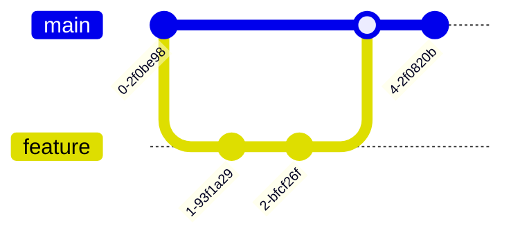

# Mermaid-Diagramm-Leitfaden für Linux 101

## Überblick
Dieser Leitfaden hilft Dozenten und Studenten, visuelle Diagramme mit Mermaid-Syntax zu erstellen. Alle Diagramme werden automatisch in GitHub, GitLab und vielen Markdown-Viewern gerendert.

## Kurzreferenz

### 1. Prozessfluss-Diagramme


**Verwenden für**: Befehlsabläufe, Entscheidungsbäume, Fehlerbehebungsanleitungen

### 2. System-Architektur


**Verwenden für**: Systemkomponenten, Netzwerktopologie, Service-Beziehungen

### 3. Sequenz-Diagramme


**Verwenden für**: System-Calls, Netzwerkprotokolle, Prozesskommunikation

### 4. Zustandsdiagramme


**Verwenden für**: Prozesszustände, Service-Lebenszyklus, Dateizustände

### 5. Git-Workflows



**Verwenden für**: Versionskontrolle, Branching-Strategien, Deployment-Abläufe

### 6. Entitäts-Beziehungen


**Verwenden für**: Berechtigungsmodelle, Datenbank-Schemas, Systembeziehungen

### 7. Gantt-Diagramme (für Kursplanung)


**Verwenden für**: Kurs-Zeitplan, Projektplanung, Labor-Termine

### 8. Kreisdiagramme (für Ressourcennutzung)


**Verwenden für**: Ressourcenverteilung, Zeitaufteilung, Umfrageergebnisse

## Best Practices

### 1. Einfach halten


### 2. Klare Bezeichnungen verwenden


### 3. Farbkodierung zur Betonung


### 4. Verwandte Elemente gruppieren


## Häufige Diagramme für Linux-Unterricht

### Berechtigungsfluss


### Boot-Prozess


### Netzwerk-Paketfluss


## Integrations-Tipps

### 1. In Markdown-Dateien
Diagramm-Code in dreifache Backticks mit `mermaid` Identifier setzen:
````markdown

````

### 2. Für Präsentationen
- Als SVG/PNG für Folien exportieren
- Live-Rendering-Tools verwenden
- Diagramme auf einzelne Folien beschränken

### 3. Studenten-Übungen
Lassen Sie Studenten Diagramme erstellen für:
- Ihr Verständnis von Konzepten
- Fehlerbehebungs-Workflows  
- System-Designs
- Befehls-Beziehungen

## Tools und Ressourcen

### Rendering-Tools
- **GitHub/GitLab**: Native Unterstützung
- **VS Code**: Mermaid-Extension
- **Online**: https://mermaid.live/
- **CLI**: `mmdc` (mermaid CLI)

### Lernressourcen
- [Offizielle Dokumentation](https://mermaid-js.github.io/mermaid/)
- [Live-Editor](https://mermaid.live/edit)
- [Beispiel-Galerie](https://mermaid-js.github.io/mermaid/#/examples)

## Übung: Eigenes erstellen

Versuchen Sie ein Diagramm zu erstellen für:
1. Wie `sudo` funktioniert
2. Dateiberechtigungs-Prüfungsfluss
3. Ihren täglichen Linux-Workflow
4. Netzwerk-Fehlerbehebungsschritte

Denken Sie daran: Diagramme sollten klären, nicht verkomplizieren!