# Mermaid Diagram Guide for Linux 101

## Overview
This guide helps instructors and students create visual diagrams using Mermaid syntax. All diagrams render automatically in GitHub, GitLab, and many Markdown viewers.

## Quick Reference

### 1. Process Flow Diagrams

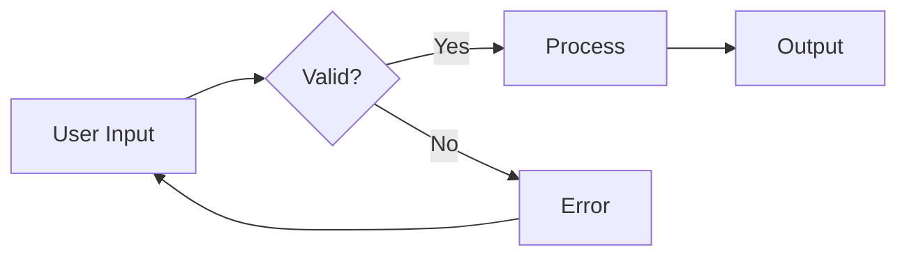

**Use for**: Command flows, decision trees, troubleshooting guides

### 2. System Architecture

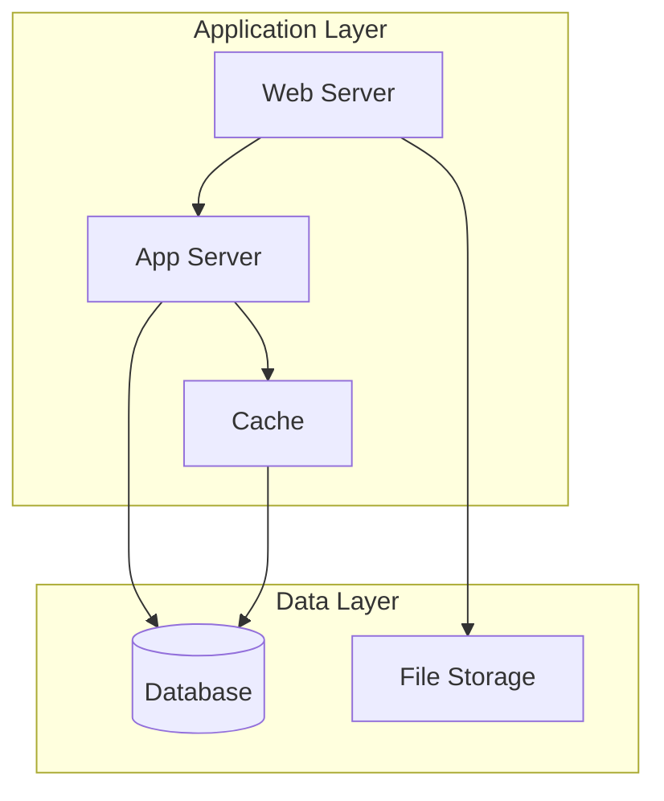

**Use for**: System components, network topology, service relationships

### 3. Sequence Diagrams

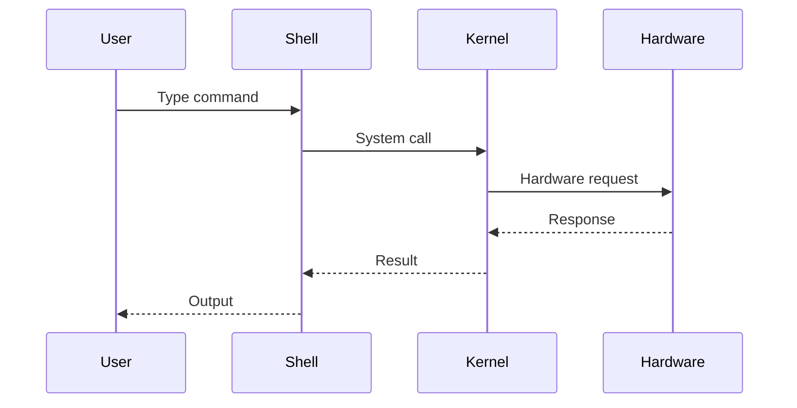

**Use for**: System calls, network protocols, process communication

### 4. State Diagrams

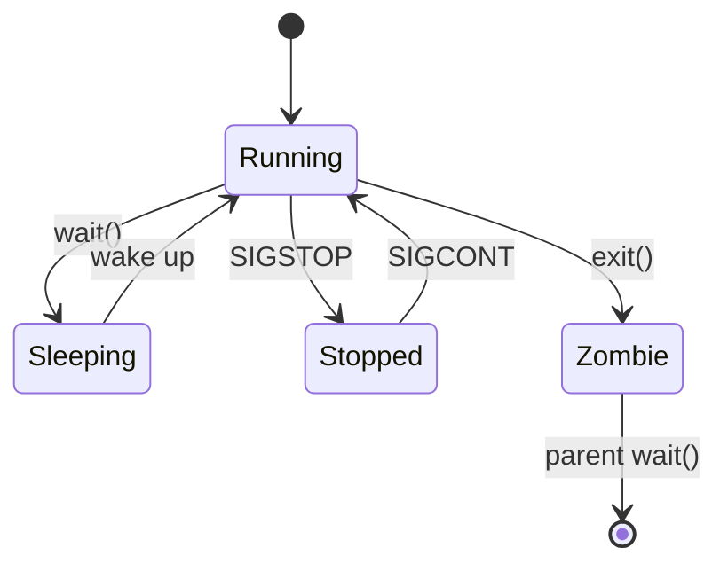

**Use for**: Process states, service lifecycle, file states

### 5. Git Workflows

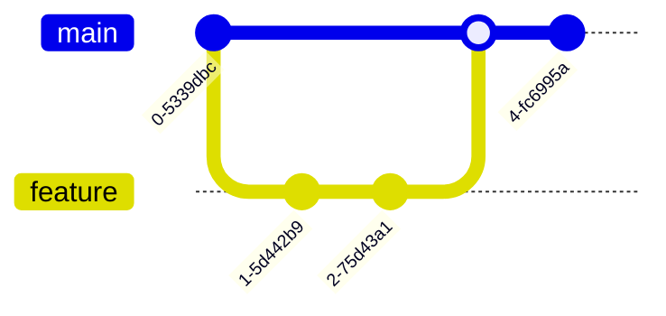

**Use for**: Version control, branching strategies, deployment flows

### 6. Entity Relationships

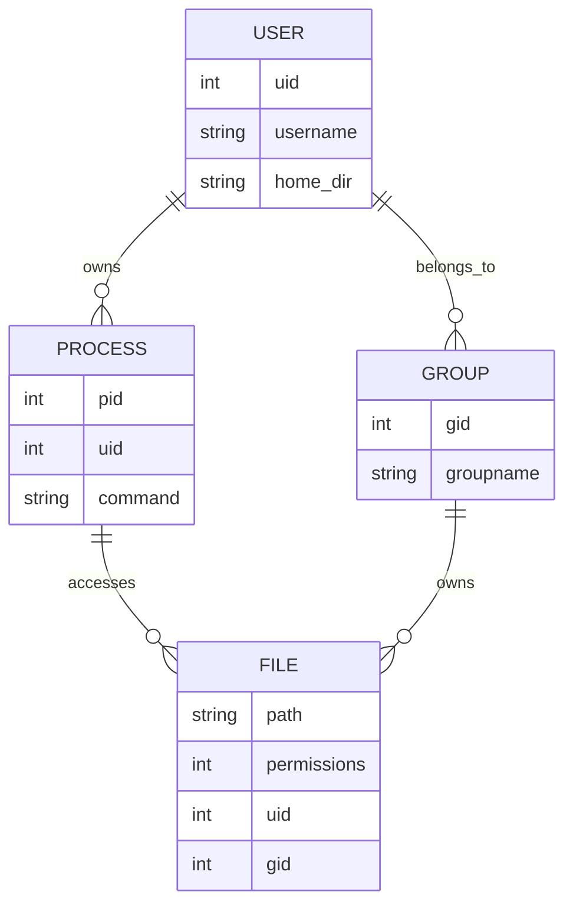

**Use for**: Permission models, database schemas, system relationships

### 7. Gantt Charts (for Course Planning)

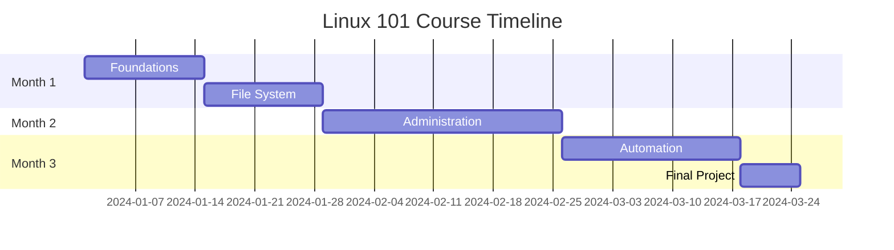

**Use for**: Course timeline, project planning, lab schedules

### 8. Pie Charts (for Resource Usage)

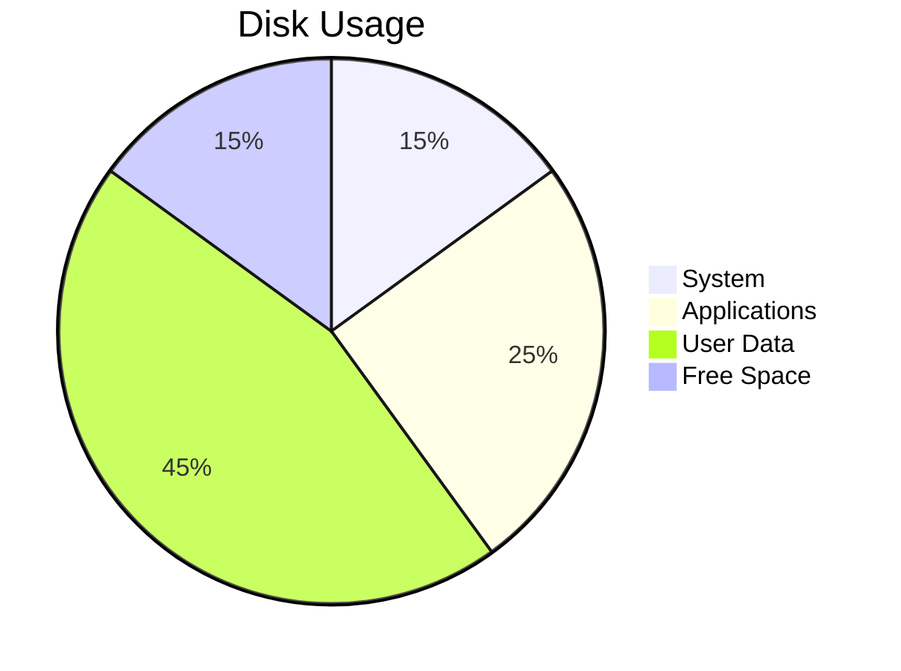

**Use for**: Resource distribution, time allocation, survey results

## Best Practices

### 1. Keep It Simple
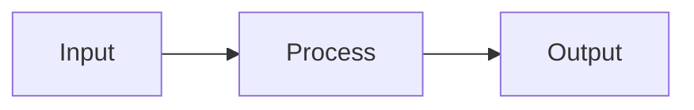

### 2. Use Clear Labels
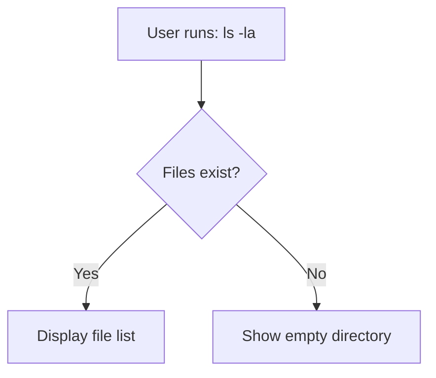

### 3. Color Coding for Emphasis
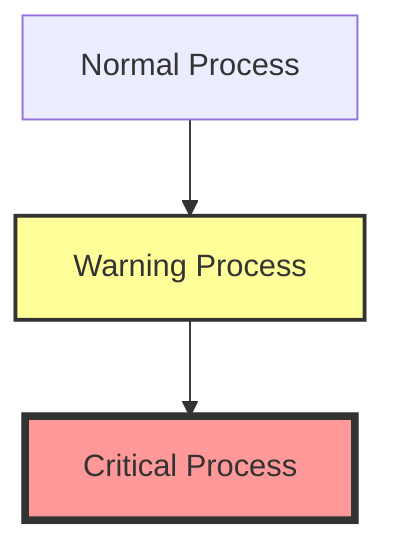

### 4. Group Related Items
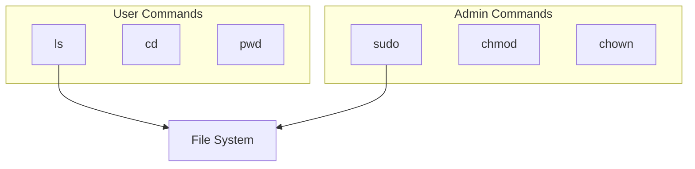

## Common Diagrams for Linux Teaching

### Permission Flow
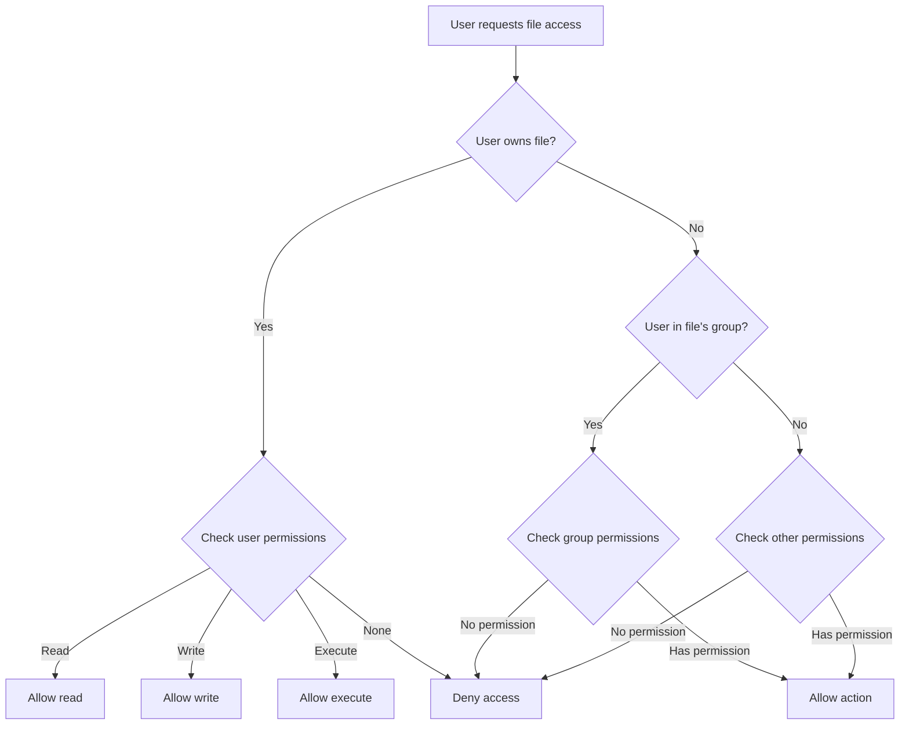

### Boot Process
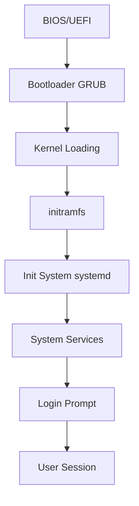

### Network Packet Flow
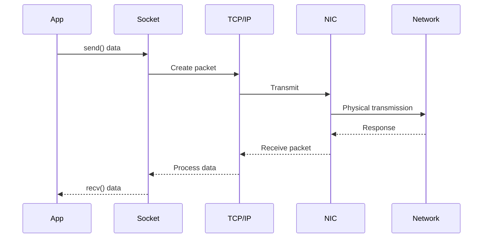

## Integration Tips

### 1. In Markdown Files
Place diagram code in triple backticks with `mermaid` identifier:
````markdown

````

### 2. For Presentations
- Export as SVG/PNG for slides
- Use live rendering tools
- Keep diagrams on single slides

### 3. Student Exercises
Have students create diagrams for:
- Their understanding of concepts
- Troubleshooting workflows  
- System designs
- Command relationships

## Tools and Resources

### Rendering Tools
- **GitHub/GitLab**: Native support
- **VS Code**: Mermaid extension
- **Online**: https://mermaid.live/
- **CLI**: `mmdc` (mermaid CLI)

### Learning Resources
- [Official Docs](https://mermaid-js.github.io/mermaid/)
- [Live Editor](https://mermaid.live/edit)
- [Examples Gallery](https://mermaid-js.github.io/mermaid/#/examples)

## Exercise: Create Your Own

Try creating a diagram for:
1. How `sudo` works
2. File permission check flow
3. Your daily Linux workflow
4. Network troubleshooting steps

Remember: Diagrams should clarify, not complicate!